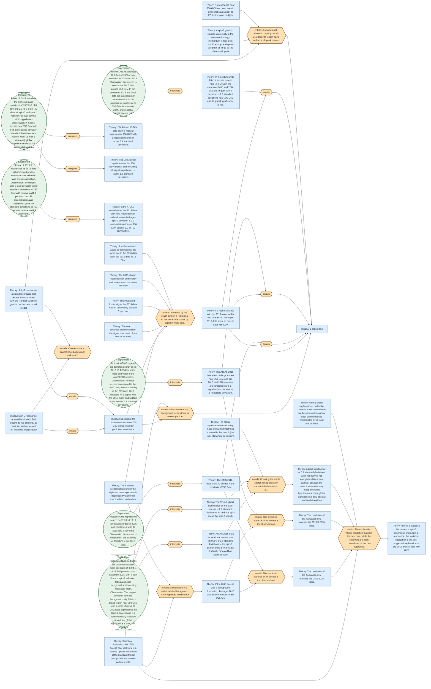

# 750 GeV diphoton excess

```mermaid
flowchart LR
  classDef theory fill:#dceeff,stroke:#315a78,stroke-width:1px
  classDef experiment fill:#e6f3e8,stroke:#39734a,stroke-width:1px
  classDef hyperedge fill:#ffe0b2,stroke:#76501e,stroke-width:2px
  t0["Theory: Hypothesis: the diphoton excess near 750 GeV is due to a new particle or resonance."]:::theory
  t1["Theory: Spin-0 resonance: a spin-0 resonance that decays to two photons, as predicted in theories with an extended Higgs sector."]:::theory
  t2["Theory: Spin-2 resonance: a spin-2 resonance that decays to two photons, with the Randall-Sundrum graviton as the benchmark model."]:::theory
  t3["Theory: ⊥ (absurdity)"]:::theory
  t4["Theory: Statistical fluctuation: the 2015 excess near 750 GeV is a chance upward fluctuation of the Standard Model background and no new particle exists."]:::theory
  t5["Theory: ATLAS 2015 data show a local excess near 750 GeV of 3.9 standard deviations in the spin-0 search and 3.8 in the spin-2 search, for a width of about 50 GeV."]:::theory
  t6["Theory: The ATLAS global significance of the 2015 excess is 2.1 standard deviations for both the spin-0 and the spin-2 search."]:::theory
  t7["Theory: CMS 8 and 13 TeV data show a modest excess near 750 GeV with a local significance of about 3.4 standard deviations."]:::theory
  t8["Theory: The CMS global significance of the 750 GeV excess, after counting all signal hypotheses, is about 1.6 standard deviations."]:::theory
  t9["Theory: In the ATLAS reanalysis of the 2015 data with new reconstruction and calibration the largest spin-0 deviation is 3.3 standard deviations at 736 GeV, against 3.9 at 750 GeV before."]:::theory
  t10["Theory: The CMS 2016 data show no excess in the proximity of 750 GeV."]:::theory
  t11["Theory: The ATLAS 2016 data show no large excess near 750 GeV, and the 2015 and 2016 datasets are compatible with a signal only at the level of 2.7 standard deviations."]:::theory
  t12["Theory: In the ATLAS 2016 data no excess is seen near 750 GeV; in the combined 2015 and 2016 data the largest spin-0 deviation is 2.6 standard deviations near 730 GeV and its global significance is null."]:::theory
  t13["Theory: If the 2015 excess was a background fluctuation, the larger 2016 data show no excess near 750 GeV."]:::theory
  t14["Theory: The Standard Model background in the diphoton mass spectrum is described by a smooth function fitted to the data."]:::theory
  t15["Theory: If a real resonance with the 2015 mass, width and rate exists, the larger 2016 data show an excess near 750 GeV."]:::theory
  t16["Theory: The search assumes that the width of the signal is at most 10 per cent of its mass."]:::theory
  t17["Theory: The integrated luminosity of the 2015 data has an uncertainty of about 5 per cent."]:::theory
  t18["Theory: The 2015 photon reconstruction and energy calibration are correct near 750 GeV."]:::theory
  t19["Theory: A real resonance would be produced at the same rate in the 2016 data as in the 2015 data at 13 TeV."]:::theory
  t20["Theory: The prediction of the fluctuation rival matches the CMS 2016 data."]:::theory
  t21["Theory: The prediction of the fluctuation rival matches the ATLAS 2016 data."]:::theory
  t22["Theory: A spin-2 graviton couples universally to the conserved energy-momentum tensor, so it would also give a lepton-pair peak as large as the photon-pair peak."]:::theory
  t23["Theory: No resonance near 750 GeV has been seen in other final states such as ZZ, lepton pairs or dijets."]:::theory
  t24["Theory: A local significance of 3.9 standard deviations near 750 GeV is not enough to claim a new particle, because the search scanned many mass and width hypotheses and the global significance is only about 2 standard deviations."]:::theory
  t25["Theory: The global significance counts every mass and width hypothesis scanned in the search (the look-elsewhere correction)."]:::theory
  t26["Theory: Among a statistical fluctuation, a spin-0 resonance and a spin-2 resonance, the statistical fluctuation is the best supported explanation of the 2015 excess near 750 GeV."]:::theory
  t27["Theory: Among these explanations, prefer the one that is not contradicted by the observations when each of the others is contradicted by at least one of them."]:::theory
  x0(["Experiment<br/>Protocol: ATLAS searches the diphoton invariant mass spectrum of 3.2 fb-1 of 13 TeV proton-proton data from 2015, with a spin-0 and a spin-2 selection, fitting a smooth background and scanning mass and width.<br/>Observation: The largest deviation from the background-only fit is in a broad region near 750 GeV with a width of about 50 GeV: local significance 3.8 (spin-2 search) and 3.9 (spin-0 search) standard deviations; global significance 2.1 for both searches."]):::experiment
  x1(["Experiment<br/>Protocol: CMS searches the diphoton mass spectrum of 19.7 fb-1 of 8 TeV and 3.3 fb-1 of 13 TeV data for spin-0 and spin-2 resonances over several width hypotheses.<br/>Observation: A modest excess near 750 GeV with local significance about 3.4 standard deviations for a narrow width (2.3 for a wide one); global significance about 1.6 standard deviations."]):::experiment
  x2(["Experiment<br/>Protocol: ATLAS reanalyses its 2015 data with improved photon reconstruction, selection and energy calibration.<br/>Observation: The largest spin-0 local deviation is 3.3 standard deviations at 736 GeV with relative width 8 per cent; the old reconstruction and calibration gave 3.9 standard deviations at 750 GeV with relative width 6 per cent."]):::experiment
  x3(["Experiment<br/>Protocol: CMS repeats the search on 12.9 fb-1 of 13 TeV data recorded in 2016 and combines it with its 2015 and 8 TeV data.<br/>Observation: No excess is observed in the proximity of 750 GeV in the 2016 data."]):::experiment
  x4(["Experiment<br/>Protocol: ATLAS repeats the diphoton search on its 2016 13 TeV data at the mass and width of the largest 2015 excess.<br/>Observation: No large excess is observed in the 2016 data; the compatibility of the 2015 and 2016 datasets for a signal with the 2015 mass and width is at the level of 2.7 standard deviations."]):::experiment
  x5(["Experiment<br/>Protocol: ATLAS analyses 36.7 fb-1 of 13 TeV data recorded in 2015 and 2016.<br/>Observation: No excess is seen in the 2016 data around 750 GeV. In the combined 2015 and 2016 data the largest spin-0 local deviation is 2.6 standard deviations near 730 GeV for a narrow width, and its global significance is null."]):::experiment
  h0{{"entails"}}:::hyperedge
  t1 --> h0
  h0 --> t0
  h1{{"entails"}}:::hyperedge
  t2 --> h1
  h1 --> t0
  h2{{"entails: A fluctuation of the background means there is no new particle."}}:::hyperedge
  t0 --> h2
  t4 --> h2
  h2 --> t3
  h3{{"entails: One resonance cannot have both spin 0 and spin 2."}}:::hyperedge
  t1 --> h3
  t2 --> h3
  h3 --> t3
  h4{{"interprets"}}:::hyperedge
  x0 --> h4
  h4 --> t5
  h5{{"interprets"}}:::hyperedge
  x0 --> h5
  h5 --> t6
  h6{{"interprets"}}:::hyperedge
  x1 --> h6
  h6 --> t7
  h7{{"interprets"}}:::hyperedge
  x1 --> h7
  h7 --> t8
  h8{{"interprets"}}:::hyperedge
  x2 --> h8
  h8 --> t9
  h9{{"interprets"}}:::hyperedge
  x3 --> h9
  h9 --> t10
  h10{{"interprets"}}:::hyperedge
  x4 --> h10
  h10 --> t11
  h11{{"interprets"}}:::hyperedge
  x5 --> h11
  h11 --> t12
  h12{{"entails: A fluctuation of a well-modelled background is not repeated in new data."}}:::hyperedge
  t4 --> h12
  t14 --> h12
  h12 --> t13
  h13{{"entails: Inference by the graph author: a real signal of the same rate shows up again in more data."}}:::hyperedge
  t0 --> h13
  t14 --> h13
  t16 --> h13
  t17 --> h13
  t18 --> h13
  t19 --> h13
  h13 --> t15
  h14{{"entails"}}:::hyperedge
  t15 --> h14
  t10 --> h14
  h14 --> t3
  h15{{"entails"}}:::hyperedge
  t15 --> h15
  t11 --> h15
  h15 --> t3
  h16{{"entails"}}:::hyperedge
  t15 --> h16
  t12 --> h16
  h16 --> t3
  h17{{"entails: The predicted absence of an excess is the observed one."}}:::hyperedge
  t13 --> h17
  t10 --> h17
  h17 --> t20
  h18{{"entails: The predicted absence of an excess is the observed one."}}:::hyperedge
  t13 --> h18
  t11 --> h18
  h18 --> t21
  h19{{"entails: A graviton with universal couplings would also decay to lepton pairs, and no such peak is seen."}}:::hyperedge
  t2 --> h19
  t22 --> h19
  t23 --> h19
  h19 --> t3
  h20{{"entails: Counting the whole search range turns 3.9 standard deviations into 2.1."}}:::hyperedge
  t5 --> h20
  t6 --> h20
  t25 --> h20
  h20 --> t24
  h21{{"entails: The explanation whose prediction matches the new data, while the other two are each contradicted, is the best supported."}}:::hyperedge
  t4 --> h21
  t20 --> h21
  t21 --> h21
  t24 --> h21
  t27 --> h21
  h21 --> t26
```
