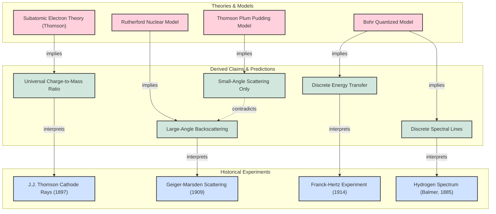

```mermaid
graph TD
    subgraph Theories ["Theories & Models"]
        SET["Subatomic Electron Theory (Thomson)"]
        TM["Thomson Plum Pudding Model"]
        RM["Rutherford Nuclear Model"]
        BM["Bohr Quantized Model"]
    end

    subgraph Predictions ["Derived Claims & Predictions"]
        UCTR["Universal Charge-to-Mass Ratio"]
        SAS["Small-Angle Scattering Only"]
        LAB["Large-Angle Backscattering"]
        DET["Discrete Energy Transfer"]
        DSL["Discrete Spectral Lines"]
    end

    subgraph Experiments ["Historical Experiments"]
        JJT["J.J. Thomson Cathode Rays (1897)"]
        GM["Geiger-Marsden Scattering (1909)"]
        FH["Franck-Hertz Experiment (1914)"]
        HS["Hydrogen Spectrum (Balmer, 1885)"]
    end

    %% Implications (Theory -> Prediction)
    SET -->|implies| UCTR
    TM -->|implies| SAS
    RM -->|implies| LAB
    BM -->|implies| DET
    BM -->|implies| DSL

    %% Contradictions
    SAS -.->|contradicts| LAB

    %% Interpretations (Prediction -> Experiment)
    UCTR -->|interprets| JJT
    LAB -->|interprets| GM
    DET -->|interprets| FH
    DSL -->|interprets| HS

    %% Styling classes
    classDef theory fill:#ffd1dc,stroke:#333,stroke-width:2px;
    classDef prediction fill:#d1e7dd,stroke:#333,stroke-width:2px;
    classDef experiment fill:#cfe2ff,stroke:#333,stroke-width:2px;

    class SET,TM,RM,BM theory;
    class UCTR,SAS,LAB,DET,DSL prediction;
    class JJT,GM,FH,HS experiment;
```
