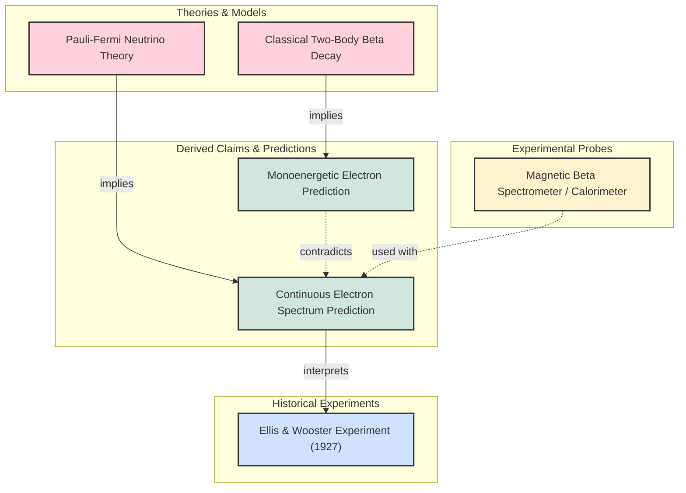

```mermaid
graph TD
    subgraph Theories ["Theories & Models"]
        CTB["Classical Two-Body Beta Decay"]
        PFN["Pauli-Fermi Neutrino Theory"]
    end

    subgraph Probes ["Experimental Probes"]
        MBS["Magnetic Beta Spectrometer / Calorimeter"]
    end

    subgraph Predictions ["Derived Claims & Predictions"]
        MEP["Monoenergetic Electron Prediction"]
        CESP["Continuous Electron Spectrum Prediction"]
    end

    subgraph Experiments ["Historical Experiments"]
        EW["Ellis & Wooster Experiment (1927)"]
    end

    %% Implications (Theory -> Prediction)
    CTB -->|implies| MEP
    PFN -->|implies| CESP

    %% Contradictions
    MEP -.->|contradicts| CESP

    %% Probe Entailments / Links
    MBS -.->|used with| CESP

    %% Interpretations (Prediction -> Experiment)
    CESP -->|interprets| EW

    %% Styling classes
    classDef theory fill:#ffd1dc,stroke:#333,stroke-width:2px;
    classDef prediction fill:#d1e7dd,stroke:#333,stroke-width:2px;
    classDef experiment fill:#cfe2ff,stroke:#333,stroke-width:2px;
    classDef probe fill:#fff3cd,stroke:#333,stroke-width:2px;

    class CTB,PFN theory;
    class MEP,CESP prediction;
    class EW experiment;
    class MBS probe;
```
