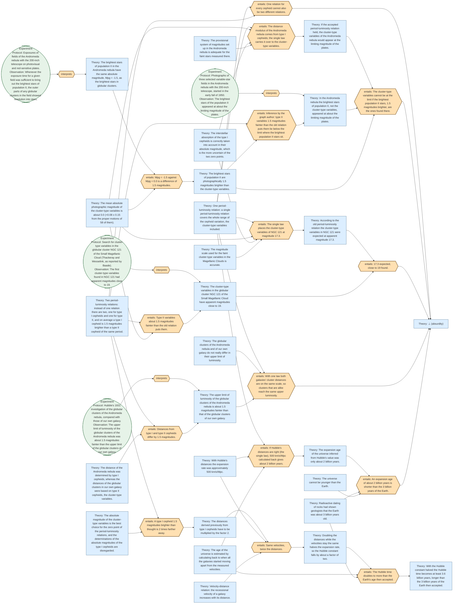

# Baade two Cepheid populations 1952

```mermaid
flowchart LR
  classDef theory fill:#dceeff,stroke:#315a78,stroke-width:1px
  classDef experiment fill:#e6f3e8,stroke:#39734a,stroke-width:1px
  classDef hyperedge fill:#ffe0b2,stroke:#76501e,stroke-width:2px
  t0["Theory: ⊥ (absurdity)"]:::theory
  t1["Theory: One period-luminosity relation: a single period-luminosity relation covers the whole range of the cepheid variation, the cluster-type variables included."]:::theory
  t2["Theory: Two period-luminosity relations: instead of one relation there are two, one for type I cepheids and one for type II, and on average a type I cepheid is 1.5 magnitudes brighter than a type II cepheid of the same period."]:::theory
  t3["Theory: In the Andromeda nebula the brightest stars of population II, not the cluster-type variables, appeared at about the limiting magnitude of the plates."]:::theory
  t4["Theory: The brightest stars of population II in the Andromeda nebula have the same absolute magnitude, Mpg = -1.5, as the brightest stars in globular clusters."]:::theory
  t5["Theory: The upper limit of luminosity of the globular clusters of the Andromeda nebula is about 1.5 magnitudes fainter than that of the globular clusters of our own galaxy."]:::theory
  t6["Theory: The cluster-type variables in the globular cluster NGC 121 of the Small Magellanic Cloud have apparent magnitudes close to 19."]:::theory
  t7["Theory: If the accepted period-luminosity relation held, the cluster-type variables of the Andromeda nebula would appear at the limiting magnitude of the plates."]:::theory
  t8["Theory: The mean absolute photographic magnitude of the cluster-type variables is about 0.0 (+0.08 ± 0.15 from the proper motions of 58 of them)."]:::theory
  t9["Theory: The interstellar absorption of the type I cepheids is correctly taken into account in their absolute magnitude, which is the more uncertain of the two zero points."]:::theory
  t10["Theory: The provisional system of magnitudes set up in the Andromeda nebula is adequate for the faint stars measured there."]:::theory
  t11["Theory: The brightest stars of population II are photographically 1.5 magnitudes brighter than the cluster-type variables."]:::theory
  t12["Theory: According to the old period-luminosity relation the cluster-type variables in NGC 121 were expected at apparent magnitude 17.3."]:::theory
  t13["Theory: The magnitude scale used for the faint cluster-type variables in the Magellanic Clouds is accurate."]:::theory
  t14["Theory: The globular clusters of the Andromeda nebula and of our own galaxy do not really differ in their upper limit of luminosity."]:::theory
  t15["Theory: The distance of the Andromeda nebula was determined by type I cepheids, whereas the distances of the globular clusters in our own galaxy were based on type II cepheids, the cluster-type variables."]:::theory
  t16["Theory: The distances derived previously from type I cepheids have to be multiplied by the factor 2."]:::theory
  t17["Theory: The absolute magnitude of the cluster-type variables is the best choice for the zero point of the period-luminosity relations, and the determinations of the absolute magnitudes of the type I cepheids are disregarded."]:::theory
  t18["Theory: The expansion age of the universe inferred from Hubble's value was only about 2 billion years."]:::theory
  t19["Theory: With Hubble's distances the expansion rate was approximately 500 km/s/Mpc."]:::theory
  t20["Theory: The age of the universe is estimated by calculating back to when all the galaxies started moving apart from the measured velocities."]:::theory
  t21["Theory: Radioactive dating of rocks had shown geologists that the Earth was about 3 billion years old."]:::theory
  t22["Theory: The universe cannot be younger than the Earth."]:::theory
  t23["Theory: Doubling the distances while the velocities stay the same halves the expansion rate, so the Hubble constant falls by about a factor of two."]:::theory
  t24["Theory: Velocity-distance relation: the recessional velocity of a galaxy increases with its distance."]:::theory
  t25["Theory: With the Hubble constant halved the Hubble time becomes at least 3.6 billion years, longer than the 3 billion years of the Earth then accepted."]:::theory
  x0(["Experiment<br/>Protocol: Photographs of three selected variable-star fields in the Andromeda nebula with the 200-inch telescope, started in the early fall of 1950.<br/>Observation: The brightest stars of the population II appeared at about the limiting magnitude of the plates."]):::experiment
  x1(["Experiment<br/>Protocol: Exposures of fields of the Andromeda nebula with the 200-inch telescope on photovisual and red-sensitive plates.<br/>Observation: Whenever the exposure time for a given field was sufficient to bring out the brightest stars of population II, the outer parts of any globular clusters in the field showed resolution into stars."]):::experiment
  x2(["Experiment<br/>Protocol: Hubble's 1931 investigation of the globular clusters of the Andromeda nebula, compared with those of our own galaxy.<br/>Observation: The upper limit of luminosity of the globular clusters of the Andromeda nebula was about 1.5 magnitudes fainter than the upper limit of the globular clusters of our own galaxy."]):::experiment
  x3(["Experiment<br/>Protocol: Search for cluster-type variables in the globular cluster NGC 121 of the Small Magellanic Cloud (Thackeray and Wesselink, as reported by Baade).<br/>Observation: The first cluster-type variables found in NGC 121 had apparent magnitudes close to 19."]):::experiment
  h0{{"entails: One relation for every cepheid cannot also be two different relations."}}:::hyperedge
  t1 --> h0
  t2 --> h0
  h0 --> t0
  h1{{"interprets"}}:::hyperedge
  x0 --> h1
  h1 --> t3
  h2{{"interprets"}}:::hyperedge
  x1 --> h2
  h2 --> t4
  h3{{"interprets"}}:::hyperedge
  x2 --> h3
  h3 --> t5
  h4{{"interprets"}}:::hyperedge
  x3 --> h4
  h4 --> t6
  h5{{"entails: The distance modulus of the Andromeda nebula comes from type I cepheids; the single law carries it over to the cluster-type variables."}}:::hyperedge
  t1 --> h5
  t8 --> h5
  t9 --> h5
  t10 --> h5
  h5 --> t7
  h6{{"entails: Mpg = -1.5 against Mpg = 0.0 is a difference of 1.5 magnitudes."}}:::hyperedge
  t4 --> h6
  t8 --> h6
  h6 --> t11
  h7{{"entails: The cluster-type variables cannot be at the limit if the brightest population II stars, 1.5 magnitudes brighter, are the ones found there."}}:::hyperedge
  t7 --> h7
  t3 --> h7
  t11 --> h7
  h7 --> t0
  h8{{"entails: The single law places the cluster-type variables of NGC 121 at magnitude 17.3."}}:::hyperedge
  t1 --> h8
  t8 --> h8
  t9 --> h8
  t13 --> h8
  h8 --> t12
  h9{{"entails: 17.3 expected, close to 19 found."}}:::hyperedge
  t12 --> h9
  t6 --> h9
  h9 --> t0
  h10{{"entails: With one law both galaxies' cluster distances are on the same scale, so clusters that are alike reach the same upper luminosity."}}:::hyperedge
  t1 --> h10
  t14 --> h10
  t5 --> h10
  h10 --> t0
  h11{{"entails: Inference by the graph author: type II variables 1.5 magnitudes fainter than the old relation puts them lie below the limit where the brightest population II stars sit."}}:::hyperedge
  t2 --> h11
  t11 --> h11
  h11 --> t3
  h12{{"entails: Distances from type I and type II cepheids differ by 1.5 magnitudes."}}:::hyperedge
  t2 --> h12
  t15 --> h12
  h12 --> t5
  h13{{"entails: Type II variables about 1.5 magnitudes fainter than the old relation puts them."}}:::hyperedge
  t2 --> h13
  t8 --> h13
  h13 --> t6
  h14{{"entails: A type I cepheid 1.5 magnitudes brighter than thought is 2 times farther away."}}:::hyperedge
  t2 --> h14
  t17 --> h14
  h14 --> t16
  h15{{"entails: If Hubble's distances are right (the single law), 500 km/s/Mpc calculated back gives about 2 billion years."}}:::hyperedge
  t1 --> h15
  t19 --> h15
  t20 --> h15
  h15 --> t18
  h16{{"entails: An expansion age of about 2 billion years is shorter than the 3 billion years of the Earth."}}:::hyperedge
  t18 --> h16
  t21 --> h16
  t22 --> h16
  h16 --> t0
  h17{{"entails: Same velocities, twice the distances."}}:::hyperedge
  t16 --> h17
  t19 --> h17
  t24 --> h17
  h17 --> t23
  h18{{"entails: The Hubble time doubles to more than the Earth's age then accepted."}}:::hyperedge
  t23 --> h18
  t20 --> h18
  t21 --> h18
  h18 --> t25
```
