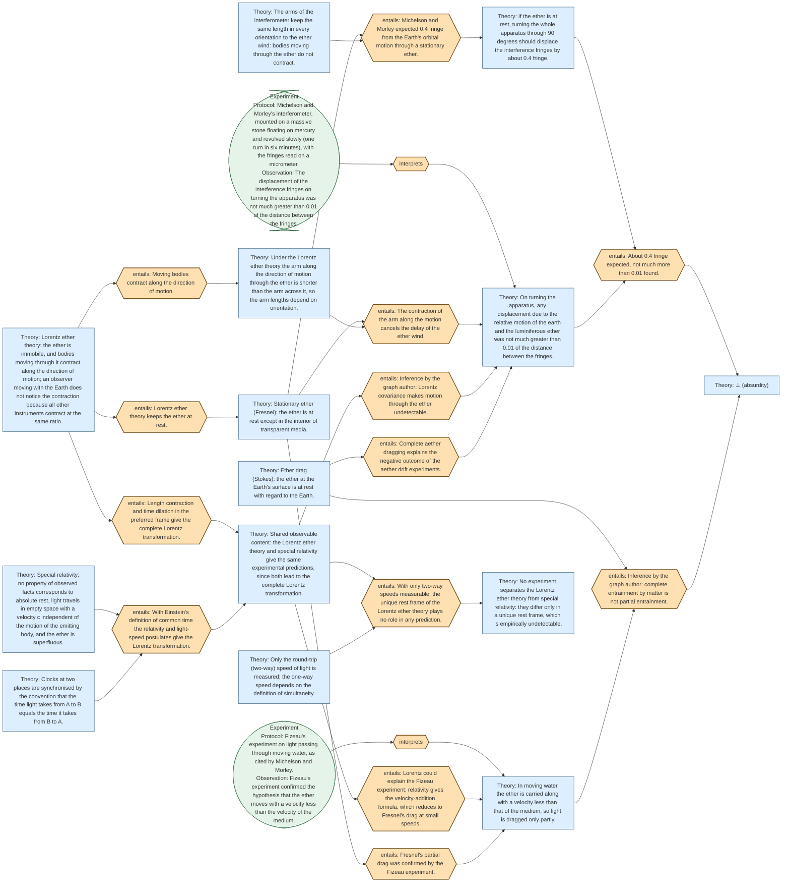

# Ether and the speed of light 1810-1938

```mermaid
flowchart LR
  classDef theory fill:#dceeff,stroke:#315a78,stroke-width:1px
  classDef experiment fill:#e6f3e8,stroke:#39734a,stroke-width:1px
  classDef hyperedge fill:#ffe0b2,stroke:#76501e,stroke-width:2px
  t0["Theory: On turning the apparatus, any displacement due to the relative motion of the earth and the luminiferous ether was not much greater than 0.01 of the distance between the fringes."]:::theory
  t1["Theory: In moving water the ether is carried along with a velocity less than that of the medium, so light is dragged only partly."]:::theory
  t2["Theory: If the ether is at rest, turning the whole apparatus through 90 degrees should displace the interference fringes by about 0.4 fringe."]:::theory
  t3["Theory: Stationary ether (Fresnel): the ether is at rest except in the interior of transparent media."]:::theory
  t4["Theory: The arms of the interferometer keep the same length in every orientation to the ether wind: bodies moving through the ether do not contract."]:::theory
  t5["Theory: ⊥ (absurdity)"]:::theory
  t6["Theory: Lorentz ether theory: the ether is immobile, and bodies moving through it contract along the direction of motion; an observer moving with the Earth does not notice the contraction because all other instruments contract at the same ratio."]:::theory
  t7["Theory: Under the Lorentz ether theory the arm along the direction of motion through the ether is shorter than the arm across it, so the arm lengths depend on orientation."]:::theory
  t8["Theory: Shared observable content: the Lorentz ether theory and special relativity give the same experimental predictions, since both lead to the complete Lorentz transformation."]:::theory
  t9["Theory: Special relativity: no property of observed facts corresponds to absolute rest, light travels in empty space with a velocity c independent of the motion of the emitting body, and the ether is superfluous."]:::theory
  t10["Theory: Clocks at two places are synchronised by the convention that the time light takes from A to B equals the time it takes from B to A."]:::theory
  t11["Theory: Ether drag (Stokes): the ether at the Earth's surface is at rest with regard to the Earth."]:::theory
  t12["Theory: No experiment separates the Lorentz ether theory from special relativity: they differ only in a unique rest frame, which is empirically undetectable."]:::theory
  t13["Theory: Only the round-trip (two-way) speed of light is measured; the one-way speed depends on the definition of simultaneity."]:::theory
  x0(["Experiment<br/>Protocol: Michelson and Morley's interferometer, mounted on a massive stone floating on mercury and revolved slowly (one turn in six minutes), with the fringes read on a micrometer.<br/>Observation: The displacement of the interference fringes on turning the apparatus was not much greater than 0.01 of the distance between the fringes."]):::experiment
  x1(["Experiment<br/>Protocol: Fizeau's experiment on light passing through moving water, as cited by Michelson and Morley.<br/>Observation: Fizeau's experiment confirmed the hypothesis that the ether moves with a velocity less than the velocity of the medium."]):::experiment
  h0{{"interprets"}}:::hyperedge
  x0 --> h0
  h0 --> t0
  h1{{"interprets"}}:::hyperedge
  x1 --> h1
  h1 --> t1
  h2{{"entails: Michelson and Morley expected 0.4 fringe from the Earth's orbital motion through a stationary ether."}}:::hyperedge
  t3 --> h2
  t4 --> h2
  h2 --> t2
  h3{{"entails: About 0.4 fringe expected, not much more than 0.01 found."}}:::hyperedge
  t2 --> h3
  t0 --> h3
  h3 --> t5
  h4{{"entails: Lorentz ether theory keeps the ether at rest."}}:::hyperedge
  t6 --> h4
  h4 --> t3
  h5{{"entails: Moving bodies contract along the direction of motion."}}:::hyperedge
  t6 --> h5
  h5 --> t7
  h6{{"entails: The contraction of the arm along the motion cancels the delay of the ether wind."}}:::hyperedge
  t3 --> h6
  t7 --> h6
  h6 --> t0
  h7{{"entails: Length contraction and time dilation in the preferred frame give the complete Lorentz transformation."}}:::hyperedge
  t6 --> h7
  h7 --> t8
  h8{{"entails: With Einstein's definition of common time the relativity and light-speed postulates give the Lorentz transformation."}}:::hyperedge
  t9 --> h8
  t10 --> h8
  h8 --> t8
  h9{{"entails: Inference by the graph author: Lorentz covariance makes motion through the ether undetectable."}}:::hyperedge
  t8 --> h9
  h9 --> t0
  h10{{"entails: Lorentz could explain the Fizeau experiment; relativity gives the velocity-addition formula, which reduces to Fresnel's drag at small speeds."}}:::hyperedge
  t8 --> h10
  h10 --> t1
  h11{{"entails: Complete aether dragging explains the negative outcome of the aether drift experiments."}}:::hyperedge
  t11 --> h11
  h11 --> t0
  h12{{"entails: Inference by the graph author: complete entrainment by matter is not partial entrainment."}}:::hyperedge
  t11 --> h12
  t1 --> h12
  h12 --> t5
  h13{{"entails: Fresnel's partial drag was confirmed by the Fizeau experiment."}}:::hyperedge
  t3 --> h13
  h13 --> t1
  h14{{"entails: With only two-way speeds measurable, the unique rest frame of the Lorentz ether theory plays no role in any prediction."}}:::hyperedge
  t8 --> h14
  t13 --> h14
  h14 --> t12
```
