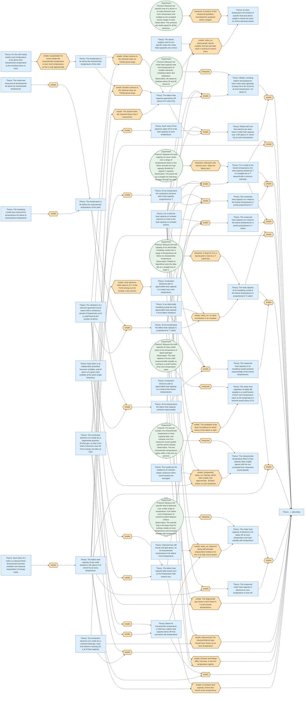

# Heat capacity of solids

```mermaid
flowchart LR
  classDef theory fill:#dceeff,stroke:#315a78,stroke-width:1px
  classDef experiment fill:#e6f3e8,stroke:#39734a,stroke-width:1px
  classDef hyperedge fill:#ffe0b2,stroke:#76501e,stroke-width:2px
  t0["Theory: ⊥ (absurdity)"]:::theory
  t1["Theory: The lattice heat capacity of any solid element is 3R (about 24.9 J/(mol K)) at every temperature."]:::theory
  t2["Theory: The lattice heat capacity falls toward zero as the temperature falls toward zero."]:::theory
  t3["Theory: Below its characteristic temperature a solid has a lattice heat capacity below 3R that increases with temperature."]:::theory
  t4["Theory: At low temperature the lattice heat capacity vanishes exponentially."]:::theory
  t5["Theory: At low temperature the lattice heat capacity is proportional to T cubed."]:::theory
  t6["Theory: The conduction electrons of a metal are a classical ideal gas, each free electron carrying 3/2 k_B of heat capacity."]:::theory
  t7["Theory: The conduction electrons of a metal are a degenerate quantum (Fermi) gas, so only a thin shell of electrons near the Fermi energy can take up heat."]:::theory
  t8["Theory: Conduction electrons add no appreciable heat capacity to a metal near room temperature."]:::theory
  t9["Theory: Conduction electrons add no appreciable heat capacity to a metal at the lowest temperatures."]:::theory
  t10["Theory: Each atom of a solid is a classical three-dimensional harmonic oscillator and classical equipartition of energy holds."]:::theory
  t11["Theory: The lattice heat capacity approaches 3R (about 24.9 J/(mol K))."]:::theory
  t12["Theory: Each atom is an independent quantised harmonic oscillator, and all atoms of a given solid oscillate at the same single frequency."]:::theory
  t13["Theory: The temperature is far above the characteristic temperature of the solid."]:::theory
  t14["Theory: The vibrations of a solid are quantised sound waves with a continuous spread of frequencies up to a cutoff fixed by the number of atoms."]:::theory
  t15["Theory: The temperature is far below the characteristic temperature of the solid."]:::theory
  t16["Theory: Each mole of free electrons adds 3/2 R to the heat capacity at room temperature."]:::theory
  t17["Theory: At low temperature the conduction electrons add a heat capacity proportional to T."]:::theory
  t18["Theory: For the soft metals tested, room temperature is far above their characteristic temperature (a few hundred kelvin or less)."]:::theory
  t19["Theory: The insulating crystal was measured at temperatures far below its characteristic temperature."]:::theory
  t20["Theory: The metal was measured at temperatures far below its characteristic temperature."]:::theory
  t21["Theory: At room temperature the product of specific heat and atomic weight is nearly the same for all the elements tested."]:::theory
  t22["Theory: For a solid the heat capacity at constant pressure is close to the heat capacity at constant volume."]:::theory
  t23["Theory: The atomic weights used to turn specific heats into molar heat capacities are correct."]:::theory
  t24["Theory: The measured molar heat capacity of diamond at room temperature is near 3R."]:::theory
  t25["Theory: The molar heat capacity of diamond is far below 3R at room temperature and rises steadily with temperature."]:::theory
  t26["Theory: Diamond has stiff bonds and light atoms, so its characteristic temperature is far above room temperature."]:::theory
  t27["Theory: The molar heat capacities of solids fall steadily to a small fraction of their room-temperature value as the temperature is lowered toward about 20 K."]:::theory
  t28["Theory: The heat capacity of an insulating crystal at the lowest temperatures is proportional to T cubed."]:::theory
  t29["Theory: In an electrically insulating crystal the only appreciable heat capacity is from lattice vibrations."]:::theory
  t30["Theory: The measured heat capacity of an insulating crystal vanishes exponentially at the lowest temperatures."]:::theory
  t31["Theory: For a metal at the lowest temperatures the heat capacity divided by T is a straight line in T squared with a nonzero intercept."]:::theory
  t32["Theory: The measured heat capacity of a metal at the lowest temperatures is purely proportional to T cubed."]:::theory
  t33["Theory: The measured heat capacity of a metal at the lowest temperatures is purely proportional to T."]:::theory
  t34["Theory: Metals, including sodium and potassium, have molar heat capacities of about 24 to 30 J/(mol K) at room temperature, not about 37."]:::theory
  t35["Theory: Metals with one free electron per atom have a molar heat capacity near 4.5R (about 37 J/(mol K)) at room temperature."]:::theory
  t36["Theory: The characteristic temperature fitted to heat-capacity data roughly agrees with the one computed from measured sound speeds."]:::theory
  t37["Theory: The crystal can be treated as an isotropic elastic continuum when sound speeds are averaged."]:::theory
  x0(["Experiment<br/>Protocol: Measure the specific heat of a dozen or so solid elements near room temperature and multiply by the accepted atomic weight of each.<br/>Observation: The products are nearly equal for all the elements."]):::experiment
  x1(["Experiment<br/>Protocol: Measure the specific heat of diamond over a wide range of temperature, from below room temperature to several hundred degrees Celsius.<br/>Observation: The specific heat is far lower than for ordinary metals at room temperature and increases steadily with temperature."]):::experiment
  x2(["Experiment<br/>Protocol: Measure the heat capacity of many solids down to the temperature of liquid hydrogen.<br/>Observation: The heat capacity of every solid measured falls steadily on cooling to a small fraction of its room-temperature value."]):::experiment
  x3(["Experiment<br/>Protocol: Measure the heat capacity of an electrically insulating crystal over a range of temperatures far below its characteristic temperature.<br/>Observation: Plotted on logarithmic axes the data fall on a straight line of slope 3."]):::experiment
  x4(["Experiment<br/>Protocol: Measure the heat capacity of a pure metal over a range of temperatures below a few kelvin and plot the heat capacity divided by T against T squared.<br/>Observation: The points fall on a straight line that does not pass through the origin."]):::experiment
  x5(["Experiment<br/>Protocol: Measure the molar heat capacity near room temperature of metallic elements, including sodium and potassium.<br/>Observation: All values lie between about 24 and 30 J/(mol K)."]):::experiment
  x6(["Experiment<br/>Protocol: For several crystals, fit a characteristic temperature to heat-capacity data, and compute one from measured sound speeds and the atomic density.<br/>Observation: The two characteristic temperatures agree within a few tens of percent."]):::experiment
  h0{{"entails: A constant heat capacity cannot also vanish at low temperature."}}:::hyperedge
  t1 --> h0
  t2 --> h0
  h0 --> t0
  h1{{"entails"}}:::hyperedge
  t1 --> h1
  t3 --> h1
  h1 --> t0
  h2{{"entails: Einstein and Debye differ only here, in the low-temperature regime."}}:::hyperedge
  t4 --> h2
  t5 --> h2
  h2 --> t0
  h3{{"entails"}}:::hyperedge
  t6 --> h3
  t7 --> h3
  h3 --> t0
  h4{{"entails: (discovered) The classical electron gas should have shown up at room temperature."}}:::hyperedge
  t6 --> h4
  t8 --> h4
  h4 --> t0
  h5{{"entails: The degenerate gas leaves a term linear in T at the lowest temperatures."}}:::hyperedge
  t7 --> h5
  t9 --> h5
  h5 --> t0
  h6{{"entails"}}:::hyperedge
  t10 --> h6
  h6 --> t1
  h7{{"entails: The shared claim: the classical theory has it everywhere."}}:::hyperedge
  t1 --> h7
  h7 --> t11
  h8{{"entails: Einstein reduces to the classical value as T/theta grows large."}}:::hyperedge
  t12 --> h8
  t13 --> h8
  h8 --> t11
  h9{{"entails: Debye reduces to the classical value as T/theta grows large."}}:::hyperedge
  t14 --> h9
  t13 --> h9
  h9 --> t11
  h10{{"entails"}}:::hyperedge
  t12 --> h10
  h10 --> t2
  h11{{"entails"}}:::hyperedge
  t14 --> h11
  h11 --> t2
  h12{{"entails"}}:::hyperedge
  t12 --> h12
  h12 --> t3
  h13{{"entails"}}:::hyperedge
  t14 --> h13
  h13 --> t3
  h14{{"entails"}}:::hyperedge
  t12 --> h14
  t15 --> h14
  h14 --> t4
  h15{{"entails"}}:::hyperedge
  t14 --> h15
  t15 --> h15
  h15 --> t5
  h16{{"entails"}}:::hyperedge
  t6 --> h16
  h16 --> t16
  h17{{"entails: Only electrons within about k_B T of the Fermi energy can be excited, a tiny fraction."}}:::hyperedge
  t7 --> h17
  h17 --> t8
  h18{{"entails"}}:::hyperedge
  t7 --> h18
  h18 --> t17
  h19{{"entails: (suspected) For some metals the characteristic temperature is near room temperature, so this is only approximate."}}:::hyperedge
  t18 --> h19
  h19 --> t13
  h20{{"entails"}}:::hyperedge
  t19 --> h20
  h20 --> t15
  h21{{"entails"}}:::hyperedge
  t20 --> h21
  h21 --> t15
  h22{{"entails: relies_on (discovered): atomic weights; the law was later used in reverse to correct them."}}:::hyperedge
  t11 --> h22
  t22 --> h22
  t23 --> h22
  h22 --> t21
  h23{{"interprets: A product of two measured quantities, normalised by assigned atomic weights."}}:::hyperedge
  x0 --> h23
  h23 --> t21
  h24{{"entails"}}:::hyperedge
  t1 --> h24
  t22 --> h24
  h24 --> t24
  h25{{"entails"}}:::hyperedge
  t24 --> h25
  t25 --> h25
  h25 --> t0
  h26{{"entails: relies_on: diamond being stiff and light; independent evidence for this is its high sound speed."}}:::hyperedge
  t3 --> h26
  t26 --> h26
  t22 --> h26
  h26 --> t25
  h27{{"interprets"}}:::hyperedge
  x1 --> h27
  h27 --> t25
  h28{{"entails: The qualitative drop does not depend on which theory of the lattice is right."}}:::hyperedge
  t2 --> h28
  t22 --> h28
  h28 --> t27
  h29{{"entails"}}:::hyperedge
  t1 --> h29
  t27 --> h29
  h29 --> t0
  h30{{"interprets"}}:::hyperedge
  x2 --> h30
  h30 --> t27
  h31{{"entails: relies_on: no other contribution in an insulator."}}:::hyperedge
  t5 --> h31
  t29 --> h31
  t22 --> h31
  h31 --> t28
  h32{{"entails"}}:::hyperedge
  t4 --> h32
  t29 --> h32
  t22 --> h32
  h32 --> t30
  h33{{"entails"}}:::hyperedge
  t30 --> h33
  t28 --> h33
  h33 --> t0
  h34{{"entails"}}:::hyperedge
  t1 --> h34
  t28 --> h34
  h34 --> t0
  h35{{"interprets: A slope of 3 on a log-log plot is read as a T cubed law."}}:::hyperedge
  x3 --> h35
  h35 --> t28
  h36{{"entails"}}:::hyperedge
  t5 --> h36
  t17 --> h36
  t22 --> h36
  h36 --> t31
  h37{{"entails"}}:::hyperedge
  t5 --> h37
  t9 --> h37
  t22 --> h37
  h37 --> t32
  h38{{"entails"}}:::hyperedge
  t4 --> h38
  t17 --> h38
  t22 --> h38
  h38 --> t33
  h39{{"entails"}}:::hyperedge
  t32 --> h39
  t31 --> h39
  h39 --> t0
  h40{{"entails"}}:::hyperedge
  t33 --> h40
  t31 --> h40
  h40 --> t0
  h41{{"entails"}}:::hyperedge
  t1 --> h41
  t31 --> h41
  h41 --> t0
  h42{{"interprets: Intercept is the electron term, slope the lattice term."}}:::hyperedge
  x4 --> h42
  h42 --> t31
  h43{{"entails"}}:::hyperedge
  t11 --> h43
  t8 --> h43
  t22 --> h43
  h43 --> t34
  h44{{"entails"}}:::hyperedge
  t11 --> h44
  t16 --> h44
  t22 --> h44
  h44 --> t35
  h45{{"entails"}}:::hyperedge
  t35 --> h45
  t34 --> h45
  h45 --> t0
  h46{{"interprets"}}:::hyperedge
  x5 --> h46
  h46 --> t34
  h47{{"entails: (suspected) relies_on: isotropy, which real crystals only approximate.  Einstein makes no such prediction."}}:::hyperedge
  t14 --> h47
  t37 --> h47
  t22 --> h47
  h47 --> t36
  h48{{"interprets"}}:::hyperedge
  x6 --> h48
  h48 --> t36
```
