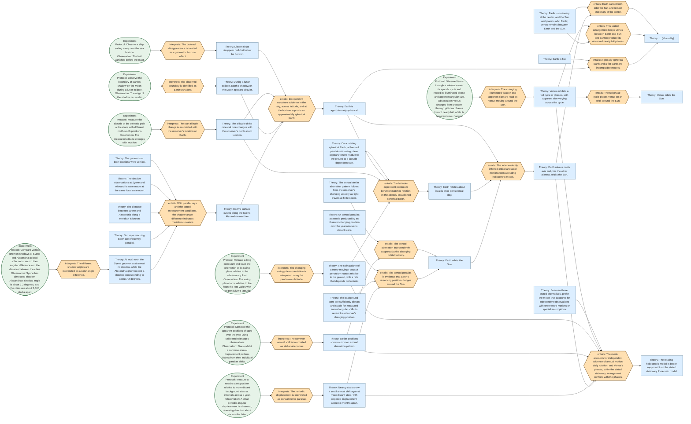

# Heliocentrism

```mermaid
flowchart LR
  classDef theory fill:#dceeff,stroke:#315a78,stroke-width:1px
  classDef experiment fill:#e6f3e8,stroke:#39734a,stroke-width:1px
  classDef hyperedge fill:#ffe0b2,stroke:#76501e,stroke-width:2px
  t0["Theory: At local noon the Syene gnomon cast almost no shadow, while the Alexandria gnomon cast a shadow corresponding to about 7.2 degrees."]:::theory
  t1["Theory: Earth's surface curves along the Syene-Alexandria meridian."]:::theory
  t2["Theory: Sun rays reaching Earth are effectively parallel."]:::theory
  t3["Theory: The distance between Syene and Alexandria along a meridian is known."]:::theory
  t4["Theory: The shadow observations at Syene and Alexandria were made at the same local solar noon."]:::theory
  t5["Theory: The gnomons at both locations were vertical."]:::theory
  t6["Theory: During a lunar eclipse, Earth's shadow on the Moon appears circular."]:::theory
  t7["Theory: The altitude of the celestial pole changes with the observer's north-south location."]:::theory
  t8["Theory: Distant ships disappear hull-first below the horizon."]:::theory
  t9["Theory: Earth is approximately spherical."]:::theory
  t10["Theory: ⊥ (absurdity)"]:::theory
  t11["Theory: Earth is flat."]:::theory
  t12["Theory: Nearby stars show a small annual shift against more distant stars, with opposite displacement about six months apart."]:::theory
  t13["Theory: Stellar positions show a common annual aberration pattern."]:::theory
  t14["Theory: The swing plane of a freely moving Foucault pendulum rotates relative to the ground, with a rate that depends on latitude."]:::theory
  t15["Theory: Venus exhibits a full cycle of phases, with apparent size varying across the cycle."]:::theory
  t16["Theory: Earth orbits the Sun."]:::theory
  t17["Theory: The background stars are sufficiently distant and stable for measured annual angular shifts to reveal the observer's changing position."]:::theory
  t18["Theory: An annual parallax pattern is produced by an observer changing position over the year relative to distant stars."]:::theory
  t19["Theory: The annual stellar aberration pattern follows from the observer's changing velocity as light travels at finite speed."]:::theory
  t20["Theory: Earth rotates about its axis once per sidereal day."]:::theory
  t21["Theory: On a rotating spherical Earth, a Foucault pendulum's swing plane appears to turn relative to the ground at a latitude-dependent rate."]:::theory
  t22["Theory: Venus orbits the Sun."]:::theory
  t23["Theory: Earth is stationary at the center, and the Sun and planets orbit Earth; Venus remains between Earth and the Sun."]:::theory
  t24["Theory: Earth rotates on its axis and, like the other planets, orbits the Sun."]:::theory
  t25["Theory: The rotating heliocentric model is better supported than the stated stationary Ptolemaic model."]:::theory
  t26["Theory: Between these stated alternatives, prefer the model that accounts for independent observations with fewer extra motions or special assumptions."]:::theory
  x0(["Experiment<br/>Protocol: Compare vertical gnomon shadows at Syene and Alexandria at local solar noon; record their angular difference and the distance between the cities.<br/>Observation: Syene has almost no shadow; Alexandria's shadow angle is about 7.2 degrees, and the cities are about 5,000 stadia apart."]):::experiment
  x1(["Experiment<br/>Protocol: Observe the boundary of Earth's shadow on the Moon during a lunar eclipse.<br/>Observation: The edge of the shadow is circular."]):::experiment
  x2(["Experiment<br/>Protocol: Measure the altitude of the celestial pole at locations with different north-south positions.<br/>Observation: The measured altitude changes with location."]):::experiment
  x3(["Experiment<br/>Protocol: Observe a ship sailing away over the sea horizon.<br/>Observation: The hull vanishes before the mast."]):::experiment
  x4(["Experiment<br/>Protocol: Measure a nearby star's position relative to more distant background stars at intervals across a year.<br/>Observation: A small periodic angular displacement is observed, reversing direction about six months later."]):::experiment
  x5(["Experiment<br/>Protocol: Compare the apparent positions of stars over the year using calibrated telescopic observations.<br/>Observation: Stars exhibit a common annual displacement pattern, distinct from their individual parallax shifts."]):::experiment
  x6(["Experiment<br/>Protocol: Release a long pendulum and track the orientation of its swing plane relative to the observatory floor.<br/>Observation: The swing plane turns relative to the floor; the rate varies with the pendulum's latitude."]):::experiment
  x7(["Experiment<br/>Protocol: Observe Venus through a telescope over its synodic cycle and record its illuminated phase and apparent angular size.<br/>Observation: Venus changes from crescent through gibbous phases toward nearly full, while its apparent size changes."]):::experiment
  h0{{"interprets: The different shadow angles are interpreted as a solar-angle difference."}}:::hyperedge
  x0 --> h0
  h0 --> t0
  h1{{"entails: With parallel rays and the stated measurement conditions, the shadow-angle difference indicates meridian curvature."}}:::hyperedge
  t0 --> h1
  t2 --> h1
  t3 --> h1
  t4 --> h1
  t5 --> h1
  h1 --> t1
  h2{{"interprets: The observed boundary is identified as Earth's shadow."}}:::hyperedge
  x1 --> h2
  h2 --> t6
  h3{{"interprets: The star-altitude change is associated with the observer's location on Earth."}}:::hyperedge
  x2 --> h3
  h3 --> t7
  h4{{"interprets: The ordered disappearance is treated as a geometric horizon effect."}}:::hyperedge
  x3 --> h4
  h4 --> t8
  h5{{"entails: Independent curvature evidence in the sky, across latitude, and at the horizon supports an approximately spherical Earth."}}:::hyperedge
  t1 --> h5
  t6 --> h5
  t7 --> h5
  t8 --> h5
  h5 --> t9
  h6{{"entails: A globally spherical Earth and a flat Earth are incompatible models."}}:::hyperedge
  t9 --> h6
  t11 --> h6
  h6 --> t10
  h7{{"interprets: The periodic displacement is interpreted as annual stellar parallax."}}:::hyperedge
  x4 --> h7
  h7 --> t12
  h8{{"interprets: The common annual shift is interpreted as stellar aberration."}}:::hyperedge
  x5 --> h8
  h8 --> t13
  h9{{"interprets: The changing swing-plane orientation is interpreted using the pendulum's latitude."}}:::hyperedge
  x6 --> h9
  h9 --> t14
  h10{{"interprets: The changing illuminated fraction and apparent size are read as Venus moving around the Sun."}}:::hyperedge
  x7 --> h10
  h10 --> t15
  h11{{"entails: The annual parallax is evidence that Earth's observing position changes around the Sun."}}:::hyperedge
  t12 --> h11
  t17 --> h11
  t18 --> h11
  h11 --> t16
  h12{{"entails: The annual aberration independently supports Earth's changing orbital velocity."}}:::hyperedge
  t13 --> h12
  t19 --> h12
  h12 --> t16
  h13{{"entails: The latitude-dependent pendulum behavior matches rotation on the already-established spherical Earth."}}:::hyperedge
  t14 --> h13
  t7 --> h13
  t9 --> h13
  t21 --> h13
  h13 --> t20
  h14{{"entails: The full phase cycle places Venus on an orbit around the Sun."}}:::hyperedge
  t15 --> h14
  h14 --> t22
  h15{{"entails: This stated arrangement keeps Venus between Earth and Sun and cannot produce its observed nearly full phases."}}:::hyperedge
  t23 --> h15
  t15 --> h15
  h15 --> t10
  h16{{"entails: The independently inferred orbital and axial motions form a rotating heliocentric model."}}:::hyperedge
  t16 --> h16
  t20 --> h16
  t9 --> h16
  h16 --> t24
  h17{{"entails: The model accounts for independent evidence of annual motion, daily rotation, and Venus's phases, while the stated stationary arrangement conflicts with the phases."}}:::hyperedge
  t24 --> h17
  t12 --> h17
  t13 --> h17
  t14 --> h17
  t15 --> h17
  t26 --> h17
  h17 --> t25
  h18{{"entails: Earth cannot both orbit the Sun and remain stationary at the center."}}:::hyperedge
  t24 --> h18
  t23 --> h18
  h18 --> t10
```
