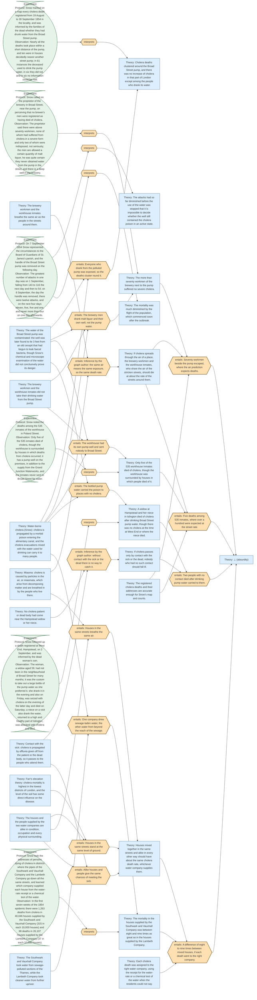

# John Snow and cholera London 1854

```mermaid
flowchart LR
  classDef theory fill:#dceeff,stroke:#315a78,stroke-width:1px
  classDef experiment fill:#e6f3e8,stroke:#39734a,stroke-width:1px
  classDef hyperedge fill:#ffe0b2,stroke:#76501e,stroke-width:2px
  t0["Theory: Cholera deaths clustered around the Broad Street pump, and there was no increase of cholera in that part of London except among the people who drank its water."]:::theory
  t1["Theory: The more than seventy workmen of the brewery next to the pump suffered no severe cholera."]:::theory
  t2["Theory: Only five of the 535 workhouse inmates died of cholera, though the workhouse was surrounded by houses in which people died of it."]:::theory
  t3["Theory: A widow at Hampstead and her niece in Islington died of cholera after drinking Broad Street pump water, though there was no cholera at the time at West End or where the niece died."]:::theory
  t4["Theory: The attacks had so far diminished before the use of the water was stopped that it is impossible to decide whether the well still contained the cholera poison in an active state."]:::theory
  t5["Theory: The mortality was much diminished by the flight of the population, which commenced soon after the outbreak."]:::theory
  t6["Theory: The mortality in the houses supplied by the Southwark and Vauxhall Company was between eight and nine times as great as in the houses supplied by the Lambeth Company."]:::theory
  t7["Theory: Water-borne cholera (Snow): cholera is propagated by a morbid poison entering the alimentary canal, and the cholera evacuations mixed with the water used for drinking can carry it to many people."]:::theory
  t8["Theory: The water of the Broad Street pump was contaminated: the well was later found to lie 3 feet from an old cesspit that had begun to leak faecal bacteria, though Snow's chemical and microscope examination of the water did not conclusively prove its danger."]:::theory
  t9["Theory: The brewery workmen and the workhouse inmates did not take their drinking water from the Broad Street pump."]:::theory
  t10["Theory: The Southwark and Vauxhall Company took water from sewage-polluted sections of the Thames, while the Lambeth Company took cleaner water from further upriver."]:::theory
  t11["Theory: If cholera spreads through the air of a place, the brewery workmen and the workhouse inmates, who share the air of the stricken streets, should die at about the rate of the streets around them."]:::theory
  t12["Theory: Miasma: cholera is caused by particles in the air, or miasmata, which arise from decomposing matter and are breathed in by the people who live there."]:::theory
  t13["Theory: The brewery workmen and the workhouse inmates breathe the same air as the people in the streets around them."]:::theory
  t14["Theory: ⊥ (absurdity)"]:::theory
  t15["Theory: The registered cholera deaths and their addresses are accurate enough for Snow's map and counts."]:::theory
  t16["Theory: If cholera passes only by contact with the sick or the dead, nobody who had no such contact should fall ill."]:::theory
  t17["Theory: Contact with the sick: cholera is propagated by effluvia given off from the patient or the dead body, so it passes to the people who attend them."]:::theory
  t18["Theory: No cholera patient or dead body had come near the Hampstead widow or her niece."]:::theory
  t19["Theory: Houses mixed together in the same streets and alike in every other way should have about the same cholera death rate, whichever water company supplies them."]:::theory
  t20["Theory: Farr's elevation theory: cholera mortality is highest in the lowest districts of London, and the level of the soil has some direct influence on the disease."]:::theory
  t21["Theory: The houses and the people supplied by the two water companies are alike in condition, occupation and every physical surrounding."]:::theory
  t22["Theory: Each cholera death was assigned to the right water company, using the receipt for the water-rate or a chemical test of the water when the residents could not say."]:::theory
  x0(["Experiment<br/>Protocol: Snow marked on a map every cholera death registered from 19 August to 30 September 1854 in the locality, and was informed by the families of the dead whether they had drunk water from the Broad Street pump.<br/>Observation: Nearly all the deaths took place within a short distance of the pump, and ten were in houses decidedly nearer another street pump; in 61 instances the deceased used to drink the pump water, in six they did not, and in six no information could be had."]):::experiment
  x1(["Experiment<br/>Protocol: Snow called on the proprietor of the brewery in Broad Street, near the pump, on perceiving that no brewer's men were registered as having died of cholera.<br/>Observation: The proprietor said there were above seventy workmen, none of whom had suffered from cholera in a severe form and only two of whom were indisposed, not seriously; the men are allowed a certain quantity of malt liquor, he was quite certain they never obtained water from the pump in the street, and there is a deep well in the brewery."]):::experiment
  x2(["Experiment<br/>Protocol: Snow noted the deaths among the 535 inmates of the workhouse in Poland Street.<br/>Observation: Only five of the 535 inmates died of cholera, though the workhouse is surrounded by houses in which deaths from cholera occurred; it has a pump-well on the premises, in addition to the supply from the Grand Junction Waterworks, and the inmates never sent to Broad Street for water."]):::experiment
  x3(["Experiment<br/>Protocol: Snow followed up a death registered at West End, Hampstead, on 2 September, and was informed by the dead woman's son.<br/>Observation: The woman, a widow aged 59, had not been in the neighbourhood of Broad Street for many months; it was the custom to take out a large bottle of the pump water as she preferred it, she drank it in the evening and also on Friday, was seized with cholera on the evening of the latter day and died on Saturday; a niece on a visit also drank the water, returned to a high and healthy part of Islington, was attacked with cholera and died."]):::experiment
  x4(["Experiment<br/>Protocol: On 7 September 1854 Snow represented the circumstances to the Board of Guardians of St. James's parish, and the handle of the Broad Street pump was removed on the following day.<br/>Observation: The greatest number of attacks in one day was on 1 September, falling from 143 to 116 the next day and then to 54; on 8 September, the day the handle was removed, there were twelve attacks, and on the next four days eleven, five, five and one, and never more than four on one day afterwards."]):::experiment
  x5(["Experiment<br/>Protocol: Snow took the addresses of persons dying of cholera in districts where the pipes of the Southwark and Vauxhall Company and the Lambeth Company go down all the same streets, and learned which company supplied each house from the water-rate receipt or a chemical test of the water.<br/>Observation: In the first seven weeks of the 1854 epidemic there were 1,263 deaths from cholera in 40,046 houses supplied by the Southwark and Vauxhall Company (315 in each 10,000 houses) and 98 deaths in 26,107 houses supplied by the Lambeth Company (37 in each 10,000 houses)."]):::experiment
  h0{{"interprets"}}:::hyperedge
  x0 --> h0
  h0 --> t0
  h1{{"interprets"}}:::hyperedge
  x1 --> h1
  h1 --> t1
  h2{{"interprets"}}:::hyperedge
  x2 --> h2
  h2 --> t2
  h3{{"interprets"}}:::hyperedge
  x3 --> h3
  h3 --> t3
  h4{{"interprets"}}:::hyperedge
  x4 --> h4
  h4 --> t4
  h5{{"interprets"}}:::hyperedge
  x4 --> h5
  h5 --> t5
  h6{{"interprets"}}:::hyperedge
  x5 --> h6
  h6 --> t6
  h7{{"entails: Everyone who drank from the polluted pump was exposed, so the deaths cluster round it."}}:::hyperedge
  t7 --> h7
  t8 --> h7
  h7 --> t0
  h8{{"entails: The brewery men drank malt liquor and their own well, not the pump water."}}:::hyperedge
  t7 --> h8
  t8 --> h8
  t9 --> h8
  h8 --> t1
  h9{{"entails: The workhouse had its own pump-well and sent nobody to Broad Street."}}:::hyperedge
  t7 --> h9
  t8 --> h9
  t9 --> h9
  h9 --> t2
  h10{{"entails: The bottled pump water carried the poison to places with no cholera."}}:::hyperedge
  t7 --> h10
  t8 --> h10
  h10 --> t3
  h11{{"entails: One company drew sewage-laden water, the other water from beyond the reach of the sewage."}}:::hyperedge
  t7 --> h11
  t10 --> h11
  h11 --> t6
  h12{{"entails: Inference by the graph author: the same air means the same exposure, so the same death rate."}}:::hyperedge
  t12 --> h12
  t13 --> h12
  h12 --> t11
  h13{{"entails: Seventy workmen beside the pump escaped, where the air prediction expects deaths."}}:::hyperedge
  t11 --> h13
  t1 --> h13
  t15 --> h13
  h13 --> t14
  h14{{"entails: Five deaths among 535 inmates, where over a hundred were expected at the street rate."}}:::hyperedge
  t11 --> h14
  t2 --> h14
  t15 --> h14
  h14 --> t14
  h15{{"entails: Inference by the graph author: without contact with the sick or the dead there is no way to catch it."}}:::hyperedge
  t17 --> h15
  t18 --> h15
  h15 --> t16
  h16{{"entails: Two people with no contact died after drinking pump water carried to them."}}:::hyperedge
  t16 --> h16
  t3 --> h16
  h16 --> t14
  h17{{"entails: Houses in the same streets stand at the same level of ground."}}:::hyperedge
  t20 --> h17
  t21 --> h17
  h17 --> t19
  h18{{"entails: Houses in the same streets breathe the same air."}}:::hyperedge
  t12 --> h18
  t21 --> h18
  h18 --> t19
  h19{{"entails: Alike houses and people give the same chances of meeting the sick."}}:::hyperedge
  t17 --> h19
  t21 --> h19
  h19 --> t19
  h20{{"entails: A difference of eight to nine times between mixed houses, if each death went to the right company."}}:::hyperedge
  t19 --> h20
  t6 --> h20
  t22 --> h20
  h20 --> t14
```
