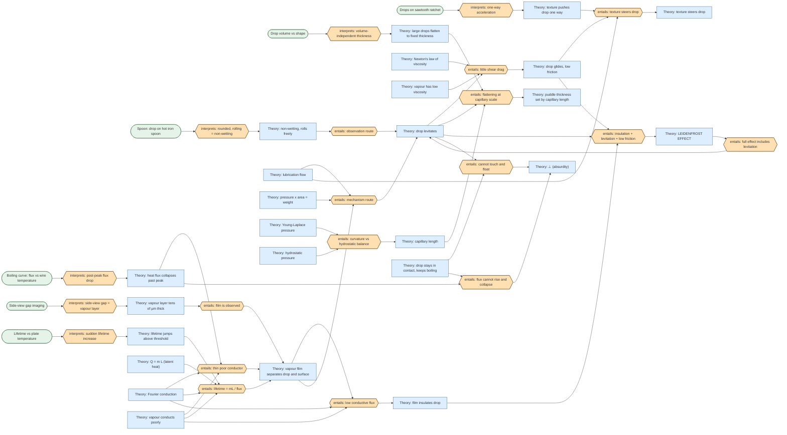

# Leidenfrost effect

```mermaid
flowchart LR
  classDef theory fill:#dceeff,stroke:#315a78,stroke-width:1px
  classDef experiment fill:#e6f3e8,stroke:#39734a,stroke-width:1px
  classDef hyperedge fill:#ffe0b2,stroke:#76501e,stroke-width:2px

  %% experiments
  x0(["Spoon: drop on hot iron spoon"]):::experiment
  x1(["Boiling curve: flux vs wire temperature"]):::experiment
  x2(["Lifetime vs plate temperature"]):::experiment
  x3(["Side-view gap imaging"]):::experiment
  x4(["Drop volume vs shape"]):::experiment
  x5(["Drops on sawtooth ratchet"]):::experiment

  %% readings
  nonWet["Theory: non-wetting, rolls freely"]:::theory
  fluxCollapse["Theory: heat flux collapses past peak"]:::theory
  lifeJump["Theory: lifetime jumps above threshold"]:::theory
  gap["Theory: vapour layer tens of µm thick"]:::theory
  flatten["Theory: large drops flatten to fixed thickness"]:::theory
  glide["Theory: texture pushes drop one way"]:::theory

  %% laws
  latent["Theory: Q = m L (latent heat)"]:::theory
  fourier["Theory: Fourier conduction"]:::theory
  lowK["Theory: vapour conducts poorly"]:::theory
  lubri["Theory: lubrication flow"]:::theory
  force["Theory: pressure x area = weight"]:::theory
  newton["Theory: Newton's law of viscosity"]:::theory
  lowMu["Theory: vapour has low viscosity"]:::theory
  laplace["Theory: Young-Laplace pressure"]:::theory
  hydro["Theory: hydrostatic pressure"]:::theory

  %% derived
  film["Theory: vapour film separates drop and surface"]:::theory
  insul["Theory: film insulates drop"]:::theory
  levit["Theory: drop levitates"]:::theory
  skit["Theory: drop glides, low friction"]:::theory
  caplen["Theory: capillary length"]:::theory
  puddle["Theory: puddle thickness set by capillary length"]:::theory
  ratchet["Theory: texture steers drop"]:::theory
  leiden["Theory: LEIDENFROST EFFECT"]:::theory

  %% rival and absurdity
  rival["Theory: drop stays in contact, keeps boiling"]:::theory
  absurd["Theory: ⊥ (absurdity)"]:::theory

  %% interprets
  x0 --> h0{{"interprets: rounded, rolling = non-wetting"}}:::hyperedge --> nonWet
  x1 --> h1{{"interprets: post-peak flux drop"}}:::hyperedge --> fluxCollapse
  x2 --> h2{{"interprets: sudden lifetime increase"}}:::hyperedge --> lifeJump
  x3 --> h3{{"interprets: side-view gap = vapour layer"}}:::hyperedge --> gap
  x4 --> h4{{"interprets: volume-independent thickness"}}:::hyperedge --> flatten
  x5 --> h5{{"interprets: one-way acceleration"}}:::hyperedge --> glide

  %% route A/B/C to the vapour film
  gap --> h6{{"entails: film is observed"}}:::hyperedge --> film
  fluxCollapse --> h7{{"entails: thin poor conductor"}}:::hyperedge
  fourier --> h7
  lowK --> h7
  h7 --> film
  lifeJump --> h8{{"entails: lifetime = mL / flux"}}:::hyperedge
  latent --> h8
  fourier --> h8
  lowK --> h8
  h8 --> film

  %% insulation
  film --> h9{{"entails: low conductive flux"}}:::hyperedge
  fourier --> h9
  lowK --> h9
  h9 --> insul

  %% levitation, two independent routes
  nonWet --> h10{{"entails: observation route"}}:::hyperedge --> levit
  film --> h11{{"entails: mechanism route"}}:::hyperedge
  lubri --> h11
  force --> h11
  h11 --> levit

  %% gliding
  levit --> h12{{"entails: little shear drag"}}:::hyperedge
  newton --> h12
  lowMu --> h12
  h12 --> skit

  %% puddles
  laplace --> h13{{"entails: curvature vs hydrostatic balance"}}:::hyperedge
  hydro --> h13
  h13 --> caplen
  flatten --> h14{{"entails: flattening at capillary scale"}}:::hyperedge
  caplen --> h14
  levit --> h14
  h14 --> puddle

  %% ratchet
  glide --> h15{{"entails: texture steers drop"}}:::hyperedge
  skit --> h15
  lubri --> h15
  h15 --> ratchet

  %% the effect
  insul --> h16{{"entails: insulation + levitation + low friction"}}:::hyperedge
  levit --> h16
  skit --> h16
  h16 --> leiden
  leiden --> h17{{"entails: full effect includes levitation"}}:::hyperedge --> levit

  %% rival theory
  rival --> h18{{"entails: cannot touch and float"}}:::hyperedge
  levit --> h18
  h18 --> absurd
  rival --> h19{{"entails: flux cannot rise and collapse"}}:::hyperedge
  fluxCollapse --> h19
  h19 --> absurd
```
