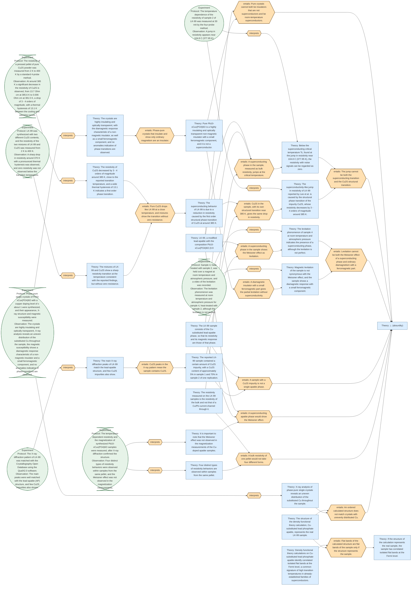

# LK-99 2023

```mermaid
flowchart LR
  classDef theory fill:#dceeff,stroke:#315a78,stroke-width:1px
  classDef experiment fill:#e6f3e8,stroke:#39734a,stroke-width:1px
  classDef hyperedge fill:#ffe0b2,stroke:#76501e,stroke-width:2px
  t0["Theory: Below the superconducting critical temperature Tc, found at the jump in resistivity near 104.8 C (377.95 K), the resistivity with noise signals can be regarded as zero."]:::theory
  t1["Theory: The superconductivity-like jump in resistivity of LK-99 reported by Lee et al. is caused by the structural phase transition of the impurity Cu2S, whose resistivity decreases by 3 - 4 orders of magnitude around 385 K."]:::theory
  t2["Theory: The levitation phenomenon of sample 4 at room temperature and atmospheric pressure indicates the presence of a superconducting phase, although the levitation is not perfect."]:::theory
  t3["Theory: Magnetic levitation of the sample is not synonymous with the Meissner effect, and the sample shows a diamagnetic response with a small ferromagnetic component."]:::theory
  t4["Theory: The main X-ray diffraction peaks of LK-99 match the lead-apatite structure, and few Cu2S impurities also show."]:::theory
  t5["Theory: The resistivity of Cu2S decreased by 3 - 4 orders of magnitude around 385 K, close to the reported transition temperature, and a wide thermal hysteresis of 13.1 K indicates a first-order phase transition."]:::theory
  t6["Theory: The mixtures of LK-99 and Cu2S show a sharp resistivity transition at the temperature consistent with the reported findings, but without zero resistance."]:::theory
  t7["Theory: The crystals are highly insulating and optically transparent, with the diamagnetic response characteristic of a non-magnetic insulator, as well as a small ferromagnetic component, and no anomalies indicative of phase transitions are observed."]:::theory
  t8["Theory: X-ray analysis of phase-pure single crystals reveals an uneven distribution of the substituted Cu throughout the sample."]:::theory
  t9["Theory: Four distinct types of resistivity behaviors are observed within samples from the same pellet."]:::theory
  t10["Theory: It is important to note that the Meissner effect was not observed in the magnetization measurements of the Cu-doped apatite samples."]:::theory
  t11["Theory: ⊥ (absurdity)"]:::theory
  t12["Theory: LK-99, a modified lead-apatite with the composition Pb10-xCux(PO4)6O (0.9<x<1.1), is a superconductor at room temperature and atmospheric pressure."]:::theory
  t13["Theory: Pure Pb10-xCux(PO4)6O is a highly insulating and optically transparent non-magnetic insulator with a small ferromagnetic component, and it is not a superconductor."]:::theory
  t14["Theory: The LK-99 sample consists of the Cu-substituted lead-apatite phase, so that its resistivity and its magnetic response are those of that phase."]:::theory
  t15["Theory: The resistivity measured on the LK-99 samples is the resistivity of the bulk and not that of a Cu/Pb current channel through it."]:::theory
  t16["Theory: The superconducting behavior of LK-99 is due to a reduction in resistivity caused by the first order structural phase transition of Cu2S at around 385 K."]:::theory
  t17["Theory: The reported LK-99 sample contained a certain amount of Cu2S impurity, with a Cu2S content of approximately 5% in sample 1 and 70% in sample 2 of one replication."]:::theory
  t18["Theory: If the structure of the calculation represents the real sample, the sample has correlated isolated flat bands at the Fermi level."]:::theory
  t19["Theory: Density functional theory calculations on Cu-substituted lead phosphate apatite identify correlated isolated flat bands at the Fermi level, a common signature of high transition temperatures in already-established families of superconductors."]:::theory
  t20["Theory: The structure of the density functional theory calculation, Cu-substituted lead phosphate apatite, represents the real LK-99 sample."]:::theory
  x0(["Experiment<br/>Protocol: The temperature dependence of the resistivity of sample 2 of LK-99 was measured at 30 mA by the four-probe method.<br/>Observation: A jump in resistivity appears near 104.8 C (377.95 K)."]):::experiment
  x1(["Experiment<br/>Protocol: Sample 4, heat-treated with sample 2, was held over a magnet at room temperature and atmospheric pressure, and a video of the levitation was recorded.<br/>Observation: The levitation phenomenon was measured at room temperature and atmospheric pressure for sample 4, heat-treated with sample 2, although the levitation is not perfect."]):::experiment
  x2(["Experiment<br/>Protocol: The X-ray diffraction pattern of LK-99 was matched with the Crystallography Open Database using the QualX2.0 software.<br/>Observation: The main peaks were well matched with the lead-apatite (AP) structure, and few Cu2S impurities also shown."]):::experiment
  x3(["Experiment<br/>Protocol: The resistivity of a pressed pellet of pure Cu2S powder was measured from 2 K to 400 K by a standard 4-probe method.<br/>Observation: At around 385 K a significant decrease in the resistivity of Cu2S is observed, from 13.7 Ohm cm at 385.6 K to 0.006 Ohm cm at 381.5 K, a drop of 3 - 4 orders of magnitude, with a thermal hysteresis of 13.1 K between the cooling and warming curves."]):::experiment
  x4(["Experiment<br/>Protocol: LK-99 was synthesized with two different Cu2S contents, and the resistivity of the two mixtures of LK-99 and Cu2S was measured from 2 K to 400 K.<br/>Observation: A sharp drop in resistivity around 370 K with a pronounced thermal hysteresis was observed, and zero resistivity was not observed below the transition temperature."]):::experiment
  x5(["Experiment<br/>Protocol: Phase-pure single crystals of Pb10-xCux(PO4)6O with a copper doping level of x about 1 were synthesized, and their appearance, X-ray structure and magnetic susceptibility were measured.<br/>Observation: The crystals are highly insulating and optically transparent, X-ray analysis reveals an uneven distribution of the substituted Cu throughout the sample, the magnetic susceptibility shows a diamagnetic response characteristic of a non-magnetic insulator and a small ferromagnetic component, and no anomalies indicative of phase transitions are observed."]):::experiment
  x6(["Experiment<br/>Protocol: The temperature-dependent resistivity and the magnetization of synthesized Pb10-xCux(PO4)6O samples were measured, after X-ray diffraction confirmed the structure.<br/>Observation: Four distinct types of resistivity behaviors were observed within samples from the same pellet, and the Meissner effect was not observed in the magnetization measurements."]):::experiment
  h0{{"interprets"}}:::hyperedge
  x0 --> h0
  h0 --> t0
  h1{{"interprets"}}:::hyperedge
  x0 --> h1
  h1 --> t1
  h2{{"interprets"}}:::hyperedge
  x1 --> h2
  h2 --> t2
  h3{{"interprets"}}:::hyperedge
  x1 --> h3
  h3 --> t3
  h4{{"interprets"}}:::hyperedge
  x2 --> h4
  h4 --> t4
  h5{{"interprets"}}:::hyperedge
  x3 --> h5
  h5 --> t5
  h6{{"interprets"}}:::hyperedge
  x4 --> h6
  h6 --> t6
  h7{{"interprets"}}:::hyperedge
  x5 --> h7
  h7 --> t7
  h8{{"interprets"}}:::hyperedge
  x5 --> h8
  h8 --> t8
  h9{{"interprets"}}:::hyperedge
  x6 --> h9
  h9 --> t9
  h10{{"interprets"}}:::hyperedge
  x6 --> h10
  h10 --> t10
  h11{{"entails: Pure crystals cannot both be insulators that are not superconductors and be room-temperature superconductors."}}:::hyperedge
  t12 --> h11
  t13 --> h11
  h11 --> t11
  h12{{"entails: The jump cannot be both the superconducting transition and the Cu2S structural transition."}}:::hyperedge
  t0 --> h12
  t1 --> h12
  h12 --> t11
  h13{{"entails: Levitation cannot be both the Meissner effect of a superconducting phase and ordinary diamagnetism with a ferromagnetic part."}}:::hyperedge
  t2 --> h13
  t3 --> h13
  h13 --> t11
  h14{{"entails: A superconducting phase in the sample, measured as bulk resistivity, jumps at the critical temperature."}}:::hyperedge
  t12 --> h14
  t14 --> h14
  t15 --> h14
  h14 --> t0
  h15{{"entails: A superconducting phase in the sample shows the Meissner effect as levitation."}}:::hyperedge
  t12 --> h15
  t14 --> h15
  h15 --> t2
  h16{{"entails: Cu2S in the sample, with its own structural transition near 385 K, gives the same drop in resistivity."}}:::hyperedge
  t16 --> h16
  t17 --> h16
  h16 --> t1
  h17{{"entails: A diamagnetic insulator with a small ferromagnetic part gives the partial levitation without superconductivity."}}:::hyperedge
  t13 --> h17
  h17 --> t3
  h18{{"entails: Cu2S peaks in the X-ray pattern mean the sample contains Cu2S."}}:::hyperedge
  t4 --> h18
  h18 --> t17
  h19{{"entails: A sample with a Cu2S impurity is not a single apatite phase."}}:::hyperedge
  t14 --> h19
  t17 --> h19
  h19 --> t11
  h20{{"entails: Pure Cu2S drops like LK-99 at a close temperature, and mixtures show the transition without zero resistance."}}:::hyperedge
  t5 --> h20
  t6 --> h20
  h20 --> t16
  h21{{"entails: Phase-pure crystals that insulate and show only ordinary magnetism are an insulator."}}:::hyperedge
  t7 --> h21
  h21 --> t13
  h22{{"entails: A superconducting apatite phase would show the Meissner effect."}}:::hyperedge
  t12 --> h22
  t14 --> h22
  t10 --> h22
  h22 --> t11
  h23{{"entails: A bulk resistivity of one pellet would not take four different forms."}}:::hyperedge
  t15 --> h23
  t9 --> h23
  h23 --> t11
  h24{{"entails: Flat bands of the calculated structure are flat bands of the sample only if the structure represents the sample."}}:::hyperedge
  t19 --> h24
  t20 --> h24
  h24 --> t18
  h25{{"entails: An ordered calculated structure does not match crystals with unevenly distributed Cu."}}:::hyperedge
  t20 --> h25
  t8 --> h25
  h25 --> t11
```
