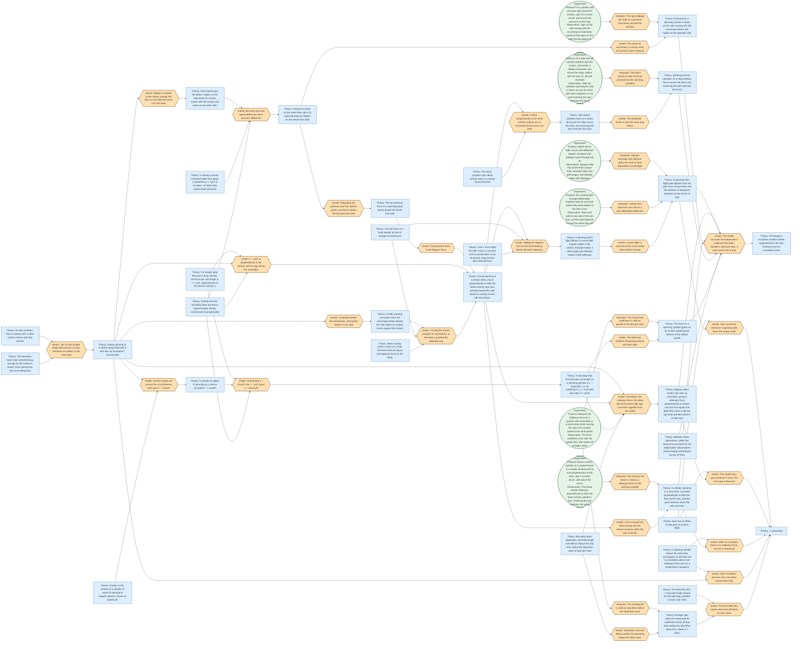

# Magnus effect

```mermaid
flowchart LR
  classDef theory fill:#dceeff,stroke:#315a78,stroke-width:1px
  classDef experiment fill:#e6f3e8,stroke:#39734a,stroke-width:1px
  classDef hyperedge fill:#ffe0b2,stroke:#76501e,stroke-width:2px
  t0["Theory: A spinning ball's flight path departs from the path of an unspun ball, and the direction of departure depends on the sense of spin."]:::theory
  t1["Theory: A cylinder spinning in a cross-flow is pushed perpendicular to both the flow and its axis, and the push reverses when the spin reverses."]:::theory
  t2["Theory: Pressure on a spinning cylinder is lower on the side moving with the oncoming stream and higher on the opposite side."]:::theory
  t3["Theory: The force on a spinning cylinder grows as its surface speed grows relative to the stream speed."]:::theory
  t4["Theory: At larger spin ratios the measured lift coefficient levels off and stays below the ideal-flow value 2πS, where S = ωR/U."]:::theory
  t5["Theory: Spinning vertical cylinders on a ship produce thrust across the wind, and reversing the spin reverses the thrust."]:::theory
  t6["Theory: A body spinning in a stream drags fluid with it and sets up circulation Γ around itself."]:::theory
  t7["Theory: No-slip condition: fluid in contact with a solid surface moves with that surface."]:::theory
  t8["Theory: The boundary layer stays attached long enough for the surface's motion to be carried into the surrounding flow."]:::theory
  t9["Theory: Fluid speed past the body is higher on the side where its surface moves with the stream and lower on the other side."]:::theory
  t10["Theory: Pressure is lower on the faster-flow side of a spinning body and higher on the slower-flow side."]:::theory
  t11["Theory: In steady, inviscid, incompressible flow along a streamline p + ½ρv² is constant, so faster flow means lower pressure."]:::theory
  t12["Theory: Outside the thin boundary layer the flow is approximately steady, inviscid and incompressible."]:::theory
  t13["Theory: The net pressure force on a spinning body points toward the faster-flow side."]:::theory
  t14["Theory: A body spinning in a stream feels a force perpendicular to both the stream and its spin axis, pointing toward the side where its surface moves with the stream."]:::theory
  t15["Theory: For steady ideal flow past a long cylinder, the force per unit length is L′ = ρUΓ, perpendicular to the stream velocity U."]:::theory
  t16["Theory: A body carrying circulation turns the oncoming stream toward the side where its surface moves against the stream."]:::theory
  t17["Theory: The net force on a body equals its rate of change of momentum."]:::theory
  t18["Theory: When a body exerts a force on a fluid, the fluid exerts an equal and opposite force on the body."]:::theory
  t19["Theory: A cylinder of radius R spinning at ω carries circulation Γ = 2πωR²."]:::theory
  t20["Theory: A point on the surface of a cylinder of radius R spinning at angular speed ω moves at speed ωR."]:::theory
  t21["Theory: In the ideal limit the force per unit length on a spinning cylinder is L′ = 2πρUωR², i.e. lift coefficient C_L = 2πS with spin ratio S = ωR/U."]:::theory
  t22["Theory: Boundary-layer separation and finite-length end effects reduce the real force below the ideal-flow value at high spin ratio."]:::theory
  t23["Theory: A spinning ball in flight follows a curved path: topspin makes it dip sooner, backspin keeps it aloft longer and sidespin makes it drift sideways."]:::theory
  t24["Theory: Over a short flight the ball's mass is constant and its acceleration is set by gravity, drag and the spin-induced force."]:::theory
  t25["Theory: Tall vertical cylinders spun on a ship's deck push the ship across the wind, and reversing the spin reverses the push."]:::theory
  t26["Theory: The ship's cylinders spin about vertical axes in a steady horizontal wind."]:::theory
  t27["Theory: Magnus effect model: spin sets up circulation, giving a sideways force perpendicular to stream and axis that equals the ideal-flow value in the low-spin limit and falls below it at high spin."]:::theory
  t28["Theory: The Magnus circulation model is better supported than the spin-irrelevant and no-circulation rivals."]:::theory
  t29["Theory: Between these alternatives, prefer the model that accounts for the independent observations without being contradicted by any of them."]:::theory
  t30["Theory: ⊥ (absurdity)"]:::theory
  t31["Theory: Spin has no effect on the path of a ball in flight."]:::theory
  t32["Theory: A spinning cylinder leaves the outer flow unchanged, so the flow has no circulation and no net sideways force acts on it (d'Alembert's paradox)."]:::theory
  t33["Theory: The ideal-flow lift L′ = 2πρUωR² holds exactly for real spinning cylinders at every spin ratio."]:::theory
  x0(["Experiment<br/>Protocol: Watch tennis balls struck with deliberate topspin, backspin and sidespin travel through still air.<br/>Observation: Topspin balls dip sooner than unspun balls, backspin balls stay aloft longer, and sidespin balls drift sideways."]):::experiment
  x1(["Experiment<br/>Protocol: Fire musket balls through deliberately imperfect barrels and mark where they land relative to the line of aim.<br/>Observation: Balls land well to one side of the aim line, and the side depends on how the barrel was set."]):::experiment
  x2(["Experiment<br/>Protocol: Mount a brass cylinder on a pivoted frame in a steady air blast with its axis perpendicular to the blast, spin it in either sense, and watch the frame.<br/>Observation: The frame swings sideways, perpendicular to both the blast and the cylinder's axis; reversing the spin reverses the swing."]):::experiment
  x3(["Experiment<br/>Protocol: Fit a cylinder with pressure taps around its surface, spin it in a wind tunnel, and record the pressure at each tap.<br/>Observation: Taps on the side moving with the oncoming air read lower pressure than taps on the side moving against it."]):::experiment
  x4(["Experiment<br/>Protocol: Measure the sideways force on a cylinder with end plates in a wind tunnel while varying the ratio of its surface speed to the wind speed.<br/>Observation: The force coefficient rises with the speed ratio, then levels off at larger ratios."]):::experiment
  x5(["Experiment<br/>Protocol: Fit a ship with tall vertical cylinders spun by motors, sail across a steady crosswind, and record the ship's motion with the spin on, off and reversed.<br/>Observation: With the cylinders spinning the ship is driven across the wind; with them stopped it is not, and reversing the spin reverses the thrust."]):::experiment
  h0{{"interprets: Topspin, backspin and sidespin paths are read as spin-dependent curved flight."}}:::hyperedge
  x0 --> h0
  h0 --> t0
  h1{{"interprets: Lateral miss distances are read as a spin-dependent deflection."}}:::hyperedge
  x1 --> h1
  h1 --> t0
  h2{{"interprets: The swing of the frame is read as a sideways force on the spinning cylinder."}}:::hyperedge
  x2 --> h2
  h2 --> t1
  h3{{"interprets: The tap readings are read as a pressure asymmetry around the cylinder."}}:::hyperedge
  x3 --> h3
  h3 --> t2
  h4{{"interprets: The rising force coefficient is read as growth of lift with spin ratio."}}:::hyperedge
  x4 --> h4
  h4 --> t3
  h5{{"interprets: The levelling-off is read as saturation below the ideal-flow value."}}:::hyperedge
  x4 --> h5
  h5 --> t4
  h6{{"interprets: The ship's motion is read as thrust produced by the spinning cylinders."}}:::hyperedge
  x5 --> h6
  h6 --> t5
  h7{{"entails: The no-slip surface drags fluid around, so spin becomes circulation in the outer flow."}}:::hyperedge
  t7 --> h7
  t8 --> h7
  h7 --> t6
  h8{{"entails: Adding circulation to the stream speeds the flow on one side and slows it on the other."}}:::hyperedge
  t6 --> h8
  h8 --> t9
  h9{{"entails: Bernoulli turns the speed difference into a pressure difference."}}:::hyperedge
  t9 --> h9
  t11 --> h9
  t12 --> h9
  h9 --> t10
  h10{{"entails: Integrating the pressure over the surface gives a net force toward the low-pressure side."}}:::hyperedge
  t10 --> h10
  h10 --> t13
  h11{{"entails: The pressure force is the Magnus force."}}:::hyperedge
  t13 --> h11
  h11 --> t14
  h12{{"entails: L′ = ρUΓ is perpendicular to the stream, with its sign set by the circulation."}}:::hyperedge
  t15 --> h12
  t6 --> h12
  t12 --> h12
  h12 --> t14
  h13{{"entails: Circulation bends the streamlines, turning the stream to one side."}}:::hyperedge
  t6 --> h13
  h13 --> t16
  h14{{"entails: Turning the stream changes its momentum, so the body is pushed the opposite way."}}:::hyperedge
  t16 --> h14
  t17 --> h14
  t18 --> h14
  h14 --> t14
  h15{{"entails: Surface speed ωR around the circumference 2πR gives Γ = 2πωR²."}}:::hyperedge
  t6 --> h15
  t20 --> h15
  h15 --> t19
  h16{{"entails: Substituting Γ = 2πωR² into L′ = ρUΓ gives L′ = 2πρUωR²."}}:::hyperedge
  t15 --> h16
  t19 --> h16
  t12 --> h16
  h16 --> t21
  h17{{"entails: The ideal law predicts lift growing linearly with spin ratio."}}:::hyperedge
  t21 --> h17
  h17 --> t3
  h18{{"entails: Separation and end effects predict lift saturating below the ideal value."}}:::hyperedge
  t22 --> h18
  h18 --> t4
  h19{{"entails: The pressure asymmetry is exactly what the pressure taps measure."}}:::hyperedge
  t10 --> h19
  h19 --> t2
  h20{{"entails: A force toward the side moving with the stream reverses when the spin reverses."}}:::hyperedge
  t14 --> h20
  h20 --> t1
  h21{{"entails: Adding the Magnus force to the force balance bends the ball's trajectory."}}:::hyperedge
  t14 --> h21
  t17 --> h21
  t24 --> h21
  h21 --> t23
  h22{{"entails: Curved flight is what the tennis and musket observations record."}}:::hyperedge
  t23 --> h22
  h22 --> t0
  h23{{"entails: A force perpendicular to the wind and the vertical axis is horizontal thrust across the wind."}}:::hyperedge
  t14 --> h23
  t26 --> h23
  h23 --> t25
  h24{{"entails: The predicted thrust is what the rotor ship shows."}}:::hyperedge
  t25 --> h24
  h24 --> t5
  h25{{"entails: Circulation, the sideways force, the ideal-flow limit and its high-spin correction together form the model."}}:::hyperedge
  t6 --> h25
  t14 --> h25
  t21 --> h25
  t22 --> h25
  h25 --> t27
  h26{{"entails: The model accounts for independent evidence from balls, cylinders, pressure taps, a wind tunnel and a ship."}}:::hyperedge
  t27 --> h26
  t0 --> h26
  t1 --> h26
  t2 --> h26
  t5 --> h26
  t3 --> h26
  t29 --> h26
  h26 --> t28
  h27{{"entails: Spin cannot be irrelevant if spinning balls leave the unspun path."}}:::hyperedge
  t31 --> h27
  t0 --> h27
  h27 --> t30
  h28{{"entails: The model says spin produces a force; the rival says it does not."}}:::hyperedge
  t31 --> h28
  t27 --> h28
  h28 --> t30
  h29{{"entails: With no circulation there is no sideways force, yet one is measured."}}:::hyperedge
  t32 --> h29
  t1 --> h29
  h29 --> t30
  h30{{"entails: Zero circulation and non-zero circulation cannot both hold."}}:::hyperedge
  t32 --> h30
  t6 --> h30
  h30 --> t30
  h31{{"entails: An exact ideal law cannot also level off below its own value."}}:::hyperedge
  t33 --> h31
  t4 --> h31
  h31 --> t30
```
