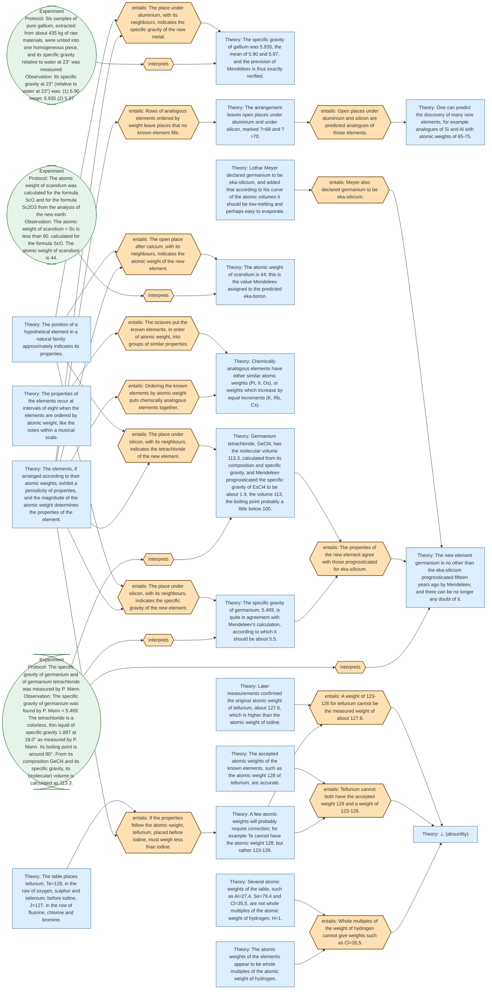

# Mendeleev periodic law 1869-86

```mermaid
flowchart LR
  classDef theory fill:#dceeff,stroke:#315a78,stroke-width:1px
  classDef experiment fill:#e6f3e8,stroke:#39734a,stroke-width:1px
  classDef hyperedge fill:#ffe0b2,stroke:#76501e,stroke-width:2px
  t0["Theory: The specific gravity of gallium was 5.935, the mean of 5.90 and 5.97, and the prevision of Mendeleev is thus exactly verified."]:::theory
  t1["Theory: The specific gravity of germanium, 5.469, is quite in agreement with Mendeleev's calculation, according to which it should be about 5.5."]:::theory
  t2["Theory: Germanium tetrachloride, GeCl4, has the molecular volume 113.3, calculated from its composition and specific gravity, and Mendeleev prognosticated the specific gravity of EsCl4 to be about 1.9, the volume 113, the boiling point probably a little below 100."]:::theory
  t3["Theory: The new element germanium is no other than the eka-silicium prognosticated fifteen years ago by Mendeleev, and there can be no longer any doubt of it."]:::theory
  t4["Theory: The atomic weight of scandium is 44; this is the value Mendeleev assigned to the predicted eka-boron."]:::theory
  t5["Theory: Chemically analogous elements have either similar atomic weights (Pt, Ir, Os), or weights which increase by equal increments (K, Rb, Cs)."]:::theory
  t6["Theory: The elements, if arranged according to their atomic weights, exhibit a periodicity of properties, and the magnitude of the atomic weight determines the properties of the element."]:::theory
  t7["Theory: The properties of the elements recur at intervals of eight when the elements are ordered by atomic weight, like the notes within a musical scale."]:::theory
  t8["Theory: The arrangement leaves open places under aluminium and under silicon, marked ?=68 and ?=70."]:::theory
  t9["Theory: One can predict the discovery of many new elements, for example analogues of Si and Al with atomic weights of 65-75."]:::theory
  t10["Theory: The position of a hypothetical element in a natural family approximately indicates its properties."]:::theory
  t11["Theory: Lothar Meyer declared germanium to be eka-silicium, and added that according to his curve of the atomic volumes it should be low-melting and perhaps easy to evaporate."]:::theory
  t12["Theory: ⊥ (absurdity)"]:::theory
  t13["Theory: The atomic weights of the elements appear to be whole multiples of the atomic weight of hydrogen."]:::theory
  t14["Theory: Several atomic weights of the table, such as Al=27,4, Se=79,4 and Cl=35,5, are not whole multiples of the atomic weight of hydrogen, H=1."]:::theory
  t15["Theory: A few atomic weights will probably require correction; for example Te cannot have the atomic weight 128, but rather 123-126."]:::theory
  t16["Theory: The table places tellurium, Te=128, in the row of oxygen, sulphur and selenium, before iodine, J=127, in the row of fluorine, chlorine and bromine."]:::theory
  t17["Theory: The accepted atomic weights of the known elements, such as the atomic weight 128 of tellurium, are accurate."]:::theory
  t18["Theory: Later measurements confirmed the original atomic weight of tellurium, about 127.6, which is higher than the atomic weight of iodine."]:::theory
  x0(["Experiment<br/>Protocol: Six samples of pure gallium, extracted from about 435 kg of raw materials, were united into one homogeneous piece, and its specific gravity relative to water at 23° was measured.<br/>Observation: Its specific gravity at 23° (relative to water at 23°) was: (1) 5.90 mean: 5.935 (2) 5.97"]):::experiment
  x1(["Experiment<br/>Protocol: The specific gravity of germanium and of germanium tetrachloride was measured by P. Mann.<br/>Observation: The specific gravity of germanium was found by P. Mann = 5.469. The tetrachloride is a colorless, thin liquid of specific gravity 1.887 at 18.0° as measured by P. Mann. Its boiling point is around 80°. From its composition GeCl4 and its specific gravity, its (molecular) volume is calculated as 113.3."]):::experiment
  x2(["Experiment<br/>Protocol: The atomic weight of scandium was calculated for the formula ScO and for the formula Sc2O3 from the analysis of the new earth.<br/>Observation: The atomic weight of scandium = Sc is less than 90, calculated for the formula ScO. The atomic weight of scandium is 44."]):::experiment
  h0{{"interprets"}}:::hyperedge
  x0 --> h0
  h0 --> t0
  h1{{"interprets"}}:::hyperedge
  x1 --> h1
  h1 --> t1
  h2{{"interprets"}}:::hyperedge
  x1 --> h2
  h2 --> t2
  h3{{"interprets"}}:::hyperedge
  x1 --> h3
  h3 --> t3
  h4{{"interprets"}}:::hyperedge
  x2 --> h4
  h4 --> t4
  h5{{"entails: Ordering the known elements by atomic weight puts chemically analogous elements together."}}:::hyperedge
  t6 --> h5
  h5 --> t5
  h6{{"entails: The octaves put the known elements, in order of atomic weight, into groups of similar properties."}}:::hyperedge
  t7 --> h6
  h6 --> t5
  h7{{"entails: Rows of analogous elements ordered by weight leave places that no known element fills."}}:::hyperedge
  t6 --> h7
  h7 --> t8
  h8{{"entails: Open places under aluminium and silicon are predicted analogues of those elements."}}:::hyperedge
  t8 --> h8
  h8 --> t9
  h9{{"entails: The place under aluminium, with its neighbours, indicates the specific gravity of the new metal."}}:::hyperedge
  t6 --> h9
  t10 --> h9
  h9 --> t0
  h10{{"entails: The place under silicon, with its neighbours, indicates the specific gravity of the new element."}}:::hyperedge
  t6 --> h10
  t10 --> h10
  h10 --> t1
  h11{{"entails: The place under silicon, with its neighbours, indicates the tetrachloride of the new element."}}:::hyperedge
  t6 --> h11
  t10 --> h11
  h11 --> t2
  h12{{"entails: The open place after calcium, with its neighbours, indicates the atomic weight of the new element."}}:::hyperedge
  t6 --> h12
  t10 --> h12
  h12 --> t4
  h13{{"entails: The properties of the new element agree with those prognosticated for eka-silicium."}}:::hyperedge
  t1 --> h13
  t2 --> h13
  h13 --> t3
  h14{{"entails: Meyer also declared germanium to be eka-silicium."}}:::hyperedge
  t11 --> h14
  h14 --> t3
  h15{{"entails: Whole multiples of the weight of hydrogen cannot give weights such as Cl=35,5."}}:::hyperedge
  t13 --> h15
  t14 --> h15
  h15 --> t12
  h16{{"entails: If the properties follow the atomic weight, tellurium, placed before iodine, must weigh less than iodine."}}:::hyperedge
  t6 --> h16
  t16 --> h16
  h16 --> t15
  h17{{"entails: Tellurium cannot both have the accepted weight 128 and a weight of 123-126."}}:::hyperedge
  t15 --> h17
  t17 --> h17
  h17 --> t12
  h18{{"entails: A weight of 123-126 for tellurium cannot be the measured weight of about 127.6."}}:::hyperedge
  t15 --> h18
  t18 --> h18
  h18 --> t12
```
