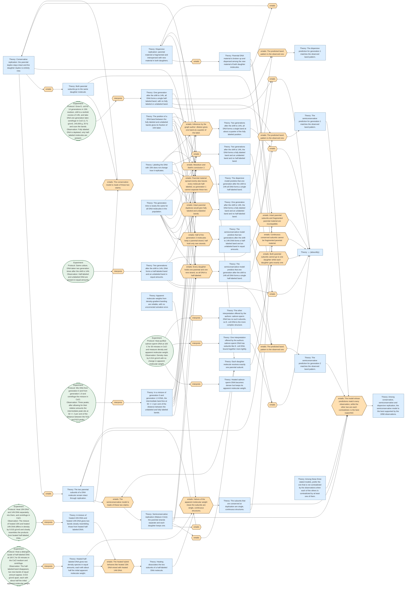

# Meselson-Stahl 1958

```mermaid
flowchart LR
  classDef theory fill:#dceeff,stroke:#315a78,stroke-width:1px
  classDef experiment fill:#e6f3e8,stroke:#39734a,stroke-width:1px
  classDef hyperedge fill:#ffe0b2,stroke:#76501e,stroke-width:2px
  t0["Theory: Conservative replication: the parental duplex stays intact and the daughter duplex is entirely new."]:::theory
  t1["Theory: The two parental subunits of a DNA molecule remain intact through replication."]:::theory
  t2["Theory: Both parental subunits go to the same daughter molecule."]:::theory
  t3["Theory: Semiconservative replication (Watson-Crick): the parental strands separate and each daughter keeps one."]:::theory
  t4["Theory: Each daughter molecule receives exactly one parental subunit."]:::theory
  t5["Theory: Dispersive replication: parental material is fragmented and interspersed with new material in both daughters."]:::theory
  t6["Theory: Parental DNA material is broken up and dispersed among the new material of both daughter molecules."]:::theory
  t7["Theory: ⊥ (absurdity)"]:::theory
  t8["Theory: One generation after the shift to 14N, all DNA forms a single half-labeled band, with no fully labeled or unlabeled band."]:::theory
  t9["Theory: Two generations after the shift to 14N, DNA forms a half-labeled band and an unlabeled band in equal amounts."]:::theory
  t10["Theory: In a mixture of generation 0 and generation 1.9 DNA, the intermediate band lies at 50 +/- 2 per cent of the distance between the unlabeled and fully labeled bands."]:::theory
  t11["Theory: Heated half-labeled DNA gives two density species in equal amounts, each with about half the initial apparent molecular weight."]:::theory
  t12["Theory: A mixture of heated 15N DNA and heated 14N DNA gives two bands closely resembling those from heated half-labeled DNA."]:::theory
  t13["Theory: Heated salmon-sperm DNA becomes denser but keeps its apparent molecular weight."]:::theory
  t14["Theory: One generation after the shift to 14N, the DNA forms a fully labeled band and an unlabeled band and no half-labeled band."]:::theory
  t15["Theory: The position of a DNA band between the fully labeled and unlabeled bands gives its fraction of 15N label."]:::theory
  t16["Theory: Labeling the DNA with 15N does not change how it replicates."]:::theory
  t17["Theory: The generation time is nearly the same for all DNA molecules in the population."]:::theory
  t18["Theory: The semiconservative model predicts that one generation after the shift to 14N all DNA forms a single half-labeled band."]:::theory
  t19["Theory: The semiconservative prediction for generation 1 matches the observed band pattern."]:::theory
  t20["Theory: The dispersive model predicts that one generation after the shift to 14N all DNA forms a single half-labeled band."]:::theory
  t21["Theory: The dispersive prediction for generation 1 matches the observed band pattern."]:::theory
  t22["Theory: Two generations after the shift to 14N, the DNA forms a fully labeled band and an unlabeled band and no half-labeled band."]:::theory
  t23["Theory: The semiconservative model predicts that two generations after the shift to 14N DNA forms a half-labeled band and an unlabeled band in equal amounts."]:::theory
  t24["Theory: The semiconservative prediction for generation 2 matches the observed band pattern."]:::theory
  t25["Theory: Two generations after the shift to 14N, all DNA forms a single band at about a quarter of the fully labeled position."]:::theory
  t26["Theory: Heating dissociates the two subunits of a half-labeled DNA molecule."]:::theory
  t27["Theory: The subunits that are conserved at duplication are single, continuous structures."]:::theory
  t28["Theory: Apparent molecular weights from density-gradient banding are reliable, with no uncorrected solvation error."]:::theory
  t29["Theory: Among conservative, semiconservative and dispersive replication, the semiconservative model is the best supported by the 1958 observations."]:::theory
  t30["Theory: Among these three stated models, prefer the one that is not contradicted by the observations when each of the others is contradicted by at least one of them."]:::theory
  t31["Theory: One interpretation offered by the authors: salmon-sperm DNA has subunits like E. coli DNA, bound together more tightly."]:::theory
  t32["Theory: The other interpretation offered by the authors: salmon-sperm DNA has no such subunits, so E. coli DNA is the more complex structure."]:::theory
  x0(["Experiment<br/>Protocol: Grow E. coli for 14 generations in 15N medium, shift to a tenfold excess of 14N, and take DNA one generation later; centrifuge in CsCl (1.71 g/cm3, 140,000 g, 20 h) and scan the bands.<br/>Observation: Fully labeled DNA is depleted; only half-labeled molecules are present."]):::experiment
  x1(["Experiment<br/>Protocol: Same culture, DNA taken two generation times after the shift to 14N.<br/>Observation: Half-labeled and unlabeled DNA are present in equal amounts."]):::experiment
  x2(["Experiment<br/>Protocol: Mix DNA from generation 0 and from generation 1.9 and centrifuge the mixture in CsCl.<br/>Observation: Three peaks; after allowing for their relative amounts the intermediate peak sits at 50 +/- 2 per cent of the distance between the N14 and N15 peaks."]):::experiment
  x3(["Experiment<br/>Protocol: Heat a detergent lysate of half-labeled DNA at 100 C for 30 minutes in the CsCl medium and centrifuge.<br/>Observation: The half-labeled band disappears; two new bands of equal amount appear, 0.015 g/cm3 apart, each with about half the initial apparent molecular weight."]):::experiment
  x4(["Experiment<br/>Protocol: Heat 15N DNA and 14N DNA separately, mix them, and centrifuge in CsCl.<br/>Observation: The mixture of heated 15N and heated 14N DNA differs in density by 0.015 g/cm3 and closely resembles the products from heated half-labeled DNA."]):::experiment
  x5(["Experiment<br/>Protocol: Heat purified salmon-sperm DNA at 100 C for 30 minutes in CsCl and measure density and apparent molecular weight.<br/>Observation: Density rises by 0.014 g/cm3 with no change in apparent molecular weight."]):::experiment
  h0{{"entails: The conservative model is made of these two claims."}}:::hyperedge
  t1 --> h0
  t2 --> h0
  h0 --> t0
  h1{{"entails"}}:::hyperedge
  t0 --> h1
  h1 --> t1
  h2{{"entails"}}:::hyperedge
  t0 --> h2
  h2 --> t2
  h3{{"entails: The semiconservative model is made of these two claims."}}:::hyperedge
  t1 --> h3
  t4 --> h3
  h3 --> t3
  h4{{"entails"}}:::hyperedge
  t3 --> h4
  h4 --> t1
  h5{{"entails"}}:::hyperedge
  t3 --> h5
  h5 --> t4
  h6{{"entails"}}:::hyperedge
  t6 --> h6
  h6 --> t5
  h7{{"entails"}}:::hyperedge
  t5 --> h7
  h7 --> t6
  h8{{"entails: Both parental subunits cannot go to one daughter while each daughter gets exactly one."}}:::hyperedge
  t2 --> h8
  t4 --> h8
  h8 --> t7
  h9{{"entails: Intact parental subunits and fragmented parental material are incompatible."}}:::hyperedge
  t1 --> h9
  t6 --> h9
  h9 --> t7
  h10{{"interprets"}}:::hyperedge
  x0 --> h10
  h10 --> t8
  h11{{"interprets"}}:::hyperedge
  x1 --> h11
  h11 --> t9
  h12{{"interprets"}}:::hyperedge
  x2 --> h12
  h12 --> t10
  h13{{"interprets"}}:::hyperedge
  x3 --> h13
  h13 --> t11
  h14{{"interprets"}}:::hyperedge
  x4 --> h14
  h14 --> t12
  h15{{"interprets"}}:::hyperedge
  x5 --> h15
  h15 --> t13
  h16{{"entails: Intact parental duplexes would give fully labeled and unlabeled bands."}}:::hyperedge
  t0 --> h16
  t15 --> h16
  t16 --> h16
  t17 --> h16
  t10 --> h16
  h16 --> t14
  h17{{"entails"}}:::hyperedge
  t14 --> h17
  t8 --> h17
  h17 --> t7
  h18{{"entails: Every daughter holds one parental and one new strand, so all DNA is half-labeled."}}:::hyperedge
  t3 --> h18
  t15 --> h18
  t16 --> h18
  t17 --> h18
  t10 --> h18
  h18 --> t18
  h19{{"entails: The predicted band pattern is the observed one."}}:::hyperedge
  t18 --> h19
  t8 --> h19
  h19 --> t19
  h20{{"entails: Parental material spread evenly also leaves every molecule half-labeled, so generation 1 cannot separate these two."}}:::hyperedge
  t5 --> h20
  t15 --> h20
  t16 --> h20
  t17 --> h20
  t10 --> h20
  h20 --> t20
  h21{{"entails: The predicted band pattern is the observed one."}}:::hyperedge
  t20 --> h21
  t8 --> h21
  h21 --> t21
  h22{{"entails"}}:::hyperedge
  t0 --> h22
  t15 --> h22
  t16 --> h22
  t17 --> h22
  t10 --> h22
  h22 --> t22
  h23{{"entails"}}:::hyperedge
  t22 --> h23
  t9 --> h23
  h23 --> t7
  h24{{"entails: Half of the generation 2 molecules keep a parental strand, half hold only new strands."}}:::hyperedge
  t3 --> h24
  t15 --> h24
  t16 --> h24
  t17 --> h24
  t10 --> h24
  h24 --> t23
  h25{{"entails: The predicted band pattern is the observed one."}}:::hyperedge
  t23 --> h25
  t9 --> h25
  h25 --> t24
  h26{{"entails: Inference by the graph author: dilution gives one band at a quarter of the label."}}:::hyperedge
  t5 --> h26
  t15 --> h26
  t16 --> h26
  t17 --> h26
  t10 --> h26
  h26 --> t25
  h27{{"entails"}}:::hyperedge
  t25 --> h27
  t9 --> h27
  h27 --> t7
  h28{{"entails: The heated hybrid behaves like heated 15N DNA mixed with heated 14N DNA."}}:::hyperedge
  t11 --> h28
  t12 --> h28
  h28 --> t26
  h29{{"entails: Halves of the apparent molecular weight mean the subunits are single, continuous structures."}}:::hyperedge
  t26 --> h29
  t11 --> h29
  t28 --> h29
  h29 --> t27
  h30{{"entails: Continuous conserved subunits cannot be fragmented parental material."}}:::hyperedge
  t27 --> h30
  t6 --> h30
  h30 --> t7
  h31{{"entails: Meselson and Stahl's conclusion 2."}}:::hyperedge
  t8 --> h31
  t9 --> h31
  t15 --> h31
  t16 --> h31
  t17 --> h31
  t10 --> h31
  h31 --> t4
  h32{{"entails: The model whose predictions match every observation, while the other two are each contradicted, is the best supported."}}:::hyperedge
  t3 --> h32
  t19 --> h32
  t24 --> h32
  t27 --> h32
  t30 --> h32
  h32 --> t29
  h33{{"interprets"}}:::hyperedge
  x5 --> h33
  h33 --> t31
  h34{{"interprets"}}:::hyperedge
  x5 --> h34
  h34 --> t32
  h35{{"entails"}}:::hyperedge
  t31 --> h35
  t32 --> h35
  h35 --> t7
```
