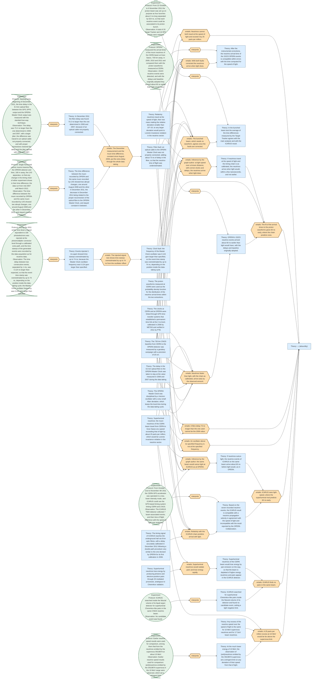

# OPERA faster-than-light neutrinos 2011-12

```mermaid
flowchart LR
  classDef theory fill:#dceeff,stroke:#315a78,stroke-width:1px
  classDef experiment fill:#e6f3e8,stroke:#39734a,stroke-width:1px
  classDef hyperedge fill:#ffe0b2,stroke:#76501e,stroke-width:2px
  t0["Theory: OPERA's 15223 neutrino events arrived about 60 ns earlier than light would have, with the delays and baseline originally adopted."]:::theory
  t1["Theory: After the instrumental corrections, the neutrino arrival time of the 15223 OPERA events is compatible within errors with the time computed for the speed of light."]:::theory
  t2["Theory: In the bunched beam test the average of the time differences measured by the Target Tracker agrees with the main analysis and with the ICARUS result."]:::theory
  t3["Theory: In December 2011 the fibre delay was found 73.2 ns larger than the one determined in 2006 and 2007, because of an optical cable not properly connected."]:::theory
  t4["Theory: Events injected 1 ms apart showed time stamps overestimated by up to 74 ns, because the Master Clock oscillator frequency was 0.124 ppm larger than specified."]:::theory
  t5["Theory: The time difference between the muon recorded by OPERA and the same muon recorded by LVD showed two abrupt changes, one around August 2008 and the other in December 2011, the decrease in December 2011 being related to the proper reconnection of the optical fibre to the OPERA Master Clock, and stayed constant in between."]:::theory
  t6["Theory: Based on the seven recorded neutrino events, the ICARUS result is compatible with a neutrino propagation velocity in agreement with the speed of light and incompatible with the result reported by the OPERA Collaboration."]:::theory
  t7["Theory: ICARUS searched for superluminal Cherenkov-like pairs inside the fiducial volume of its detector and found no candidate event, setting a tight negative limit."]:::theory
  t8["Theory: At the much lower energy of 10 MeV, the observation of (anti)neutrinos emitted by the SN1987A supernova set a stringent limit on any deviation of their speed from that of light."]:::theory
  t9["Theory: ⊥ (absurdity)"]:::theory
  t10["Theory: Relativity: neutrinos travel at the speed of light, their rest mass making the relative deviation smaller than 10^-19, so any larger deviation would point to Lorentz invariance violation in the neutrino sector."]:::theory
  t11["Theory: Superluminal neutrinos: the muon neutrinos of the CERN beam travel from CERN to Gran Sasso at a speed exceeding that of light by about 25 parts per million, which would be Lorentz invariance violation in the neutrino sector."]:::theory
  t12["Theory: If neutrinos travel at the speed of light and the timing chain is as calibrated, the neutrinos arrive when light would, within a few nanoseconds, and not earlier."]:::theory
  t13["Theory: The clocks at CERN and at OPERA were linked through GPS time-transfer systems that established a permanent time link at the 2 ns level, calibrated in 2008 by METAS and verified in 2011 by PTB."]:::theory
  t14["Theory: The 730 km CNGS baseline from CERN to the OPERA detector was measured by a geodesy campaign with a precision of 20 cm."]:::theory
  t15["Theory: The delay in the 8.3 km optical fibre to the OPERA Master Clock was taken to stay at the value measured in 2006 and 2007 during the data taking."]:::theory
  t16["Theory: The OPERA Master Clock was disciplined by a Vectron oscillator with a very small Allan deviation, which keeps the local time during the data-taking cycle."]:::theory
  t17["Theory: The proton waveforms measured at CERN were used as the probability density function for the distribution of the neutrino arrival times within the two extractions."]:::theory
  t18["Theory: Fibre fault: an optical cable to the OPERA Master Clock was not properly connected, adding about 73 ns of delay in the fibre, so that the neutrino time of flight was underestimated."]:::theory
  t19["Theory: Clock fault: the frequency of the Master Clock oscillator was 0.124 ppm larger than specified, so the event time stamp was overestimated by up to 74 ns, depending on the position inside the data-taking cycle."]:::theory
  t20["Theory: If neutrinos outrun light, the neutrino events of ICARUS on the same beam arrive about 60 ns before light would, as in OPERA."]:::theory
  t21["Theory: The timing signal of ICARUS reaches the underground hall via 8 km optic fibres, with a delay accurately calibrated in December 2011 following a double path procedure very similar to the one devised by OPERA for its first calibration in 2006."]:::theory
  t22["Theory: Superluminal neutrinos of the CERN beam would lose energy by pair emission on the way, so that the beam is depleted of higher energy neutrinos and pairs appear in the ICARUS detector."]:::theory
  t23["Theory: Superluminal neutrinos lose energy by producing photons and electron-positron pairs through Z0 mediated processes, analogous to Cherenkov radiation."]:::theory
  t24["Theory: Any excess of the neutrino speed over the speed of light is the same for 10 MeV supernova neutrinos and for 17 GeV beam neutrinos."]:::theory
  x0(["Experiment<br/>Protocol: OPERA measured the arrival times of the muon neutrinos of the CERN beam at Gran Sasso, 730 km away, in 2009, 2010 and 2011 and compared them with the proton waveforms measured at CERN.<br/>Observation: 15223 neutrino events were detected, and with the delays and baseline originally adopted they arrived about 60 ns earlier than light would have."]):::experiment
  x1(["Experiment<br/>Protocol: From 22 October to 6 November 2011 the proton beam was set up on purpose as four bunches about 3 ns long separated by 524 ns, so that each neutrino event could be associated to its proton bunch.<br/>Observation: A total of 20 Target Tracker and 16 RPC events were retained."]):::experiment
  x2(["Experiment<br/>Protocol: Starting at the beginning of December 2011, the time delay in the 8.3 km optical fibre between the GPS 1PPS output and the OPERA Master Clock output was measured with the standard two-way technique.<br/>Observation: The delay was 73.2 ns larger than the one determined in 2006 and 2007, with a larger jitter; the difference was traced to an optical cable not properly connected, and with proper connections restored the delay and the jitter agreed with 2006 and 2007."]):::experiment
  x3(["Experiment<br/>Protocol: During the 2011 winter shut down a signal equivalent to 100 photoelectrons was injected at the photomultiplier connector level through a calibrated extra path, and the time stamps of the generated events were recorded by the data acquisition as for neutrino data.<br/>Observation: The time delay between two consecutive events, separated by 1 ms, was 0.124 ns larger than expected, so that the event time stamp was overestimated by up to 74 ns, depending on the position inside the data-taking cycle; the Master Clock oscillator frequency was 0.124 ppm larger than specified."]):::experiment
  x4(["Experiment<br/>Protocol: Single horizontal cosmic muons traverse first the OPERA detector and then, 160 m away, the LVD apparatus, so that any change in the timing chain of either experiment shows in their time difference; the data run from mid 2007 until March 2012.<br/>Observation: The time difference between the muon recorded by OPERA and the same muon recorded by LVD showed two abrupt changes, one around August 2008 and the other in December 2011, and stayed constant in between."]):::experiment
  x5(["Experiment<br/>Protocol: From October 21st to November 4th 2011 the CERN-SPS accelerator was operated in a new, lower intensity mode, and ICARUS could use the GPS-based timing system linking CERN and LNGS.<br/>Observation: The ICARUS T600 detector collected 7 beam-associated events, and their time of flight difference with the speed of light was analysed."]):::experiment
  x6(["Experiment<br/>Protocol: ICARUS searched inside the fiducial volume of its liquid argon detector for superluminal Cherenkov-like pairs in the same CNGS neutrino beam.<br/>Observation: No candidate event was found."]):::experiment
  x7(["Experiment<br/>Protocol: Earlier neutrino speed results were used for comparison, among them that from the neutrinos emitted by the supernova SN1987A at about 10 MeV.<br/>Observation: Earlier neutrino speed results used for comparison: (anti)neutrinos emitted by the SN1987A supernova in the 10 MeV range were observed, which set a stringent limit."]):::experiment
  h0{{"interprets"}}:::hyperedge
  x0 --> h0
  h0 --> t0
  h1{{"interprets"}}:::hyperedge
  x0 --> h1
  h1 --> t1
  h2{{"interprets"}}:::hyperedge
  x1 --> h2
  h2 --> t2
  h3{{"interprets"}}:::hyperedge
  x2 --> h3
  h3 --> t3
  h4{{"interprets"}}:::hyperedge
  x3 --> h4
  h4 --> t4
  h5{{"interprets"}}:::hyperedge
  x4 --> h5
  h5 --> t5
  h6{{"interprets"}}:::hyperedge
  x5 --> h6
  h6 --> t6
  h7{{"interprets"}}:::hyperedge
  x6 --> h7
  h7 --> t7
  h8{{"interprets"}}:::hyperedge
  x7 --> h8
  h8 --> t8
  h9{{"entails: Neutrinos cannot both travel at the speed of light and exceed it by 25 parts per million."}}:::hyperedge
  t10 --> h9
  t11 --> h9
  h9 --> t9
  h10{{"entails: Inference by the graph author: at light speed over a known distance, with correct clocks and delays, the neutrinos arrive when light does."}}:::hyperedge
  t10 --> h10
  t13 --> h10
  t14 --> h10
  t15 --> h10
  t16 --> h10
  h10 --> t12
  h11{{"entails: The fit of the arrival times to the proton waveforms gives 60 ns early, where the chain predicts none."}}:::hyperedge
  t12 --> h11
  t17 --> h11
  t0 --> h11
  h11 --> t9
  h12{{"entails: Neutrinos faster than light, with the chain as calibrated, arrive early by the observed amount."}}:::hyperedge
  t11 --> h12
  t13 --> h12
  t14 --> h12
  t15 --> h12
  t16 --> h12
  t17 --> h12
  h12 --> t0
  h13{{"entails: A fibre delay 73 ns longer than the one used cannot be the 2006 value."}}:::hyperedge
  t15 --> h13
  t18 --> h13
  h13 --> t9
  h14{{"entails: An oscillator above its specified frequency is not at the specified frequency."}}:::hyperedge
  t16 --> h14
  t19 --> h14
  h14 --> t9
  h15{{"entails: The December measurement and the muon time difference, constant since August 2008, put the extra delay through the whole data taking."}}:::hyperedge
  t3 --> h15
  t5 --> h15
  h15 --> t18
  h16{{"entails: The injected-signal test shows time stamps overestimated by up to 74 ns from the oscillator offset."}}:::hyperedge
  t4 --> h16
  h16 --> t19
  h17{{"entails: With both faults corrected the neutrinos arrive when light does."}}:::hyperedge
  t10 --> h17
  t13 --> h17
  t14 --> h17
  t18 --> h17
  t19 --> h17
  t17 --> h17
  h17 --> t1
  h18{{"entails: The bunched beam, which needs no waveform, agrees once the faults are corrected."}}:::hyperedge
  t10 --> h18
  t13 --> h18
  t14 --> h18
  t18 --> h18
  t19 --> h18
  h18 --> t2
  h19{{"entails: Inference by the graph author: the same beam would outrun light at ICARUS as at OPERA."}}:::hyperedge
  t11 --> h19
  t13 --> h19
  t14 --> h19
  t21 --> h19
  h19 --> t20
  h20{{"entails: ICARUS sees light speed, where the superluminal rival predicts 60 ns early."}}:::hyperedge
  t20 --> h20
  t6 --> h20
  h20 --> t9
  h21{{"entails: Relativity with the ICARUS chain predicts arrival with light."}}:::hyperedge
  t10 --> h21
  t13 --> h21
  t14 --> h21
  t21 --> h21
  h21 --> t6
  h22{{"entails: Superluminal neutrinos would radiate pairs and lose energy rapidly."}}:::hyperedge
  t11 --> h22
  t23 --> h22
  h22 --> t22
  h23{{"entails: ICARUS finds no pairs in the same beam."}}:::hyperedge
  t22 --> h23
  t7 --> h23
  h23 --> t9
  h24{{"entails: A 25 parts per million excess at 10 MeV would be far above the supernova limit."}}:::hyperedge
  t11 --> h24
  t24 --> h24
  t8 --> h24
  h24 --> t9
```
