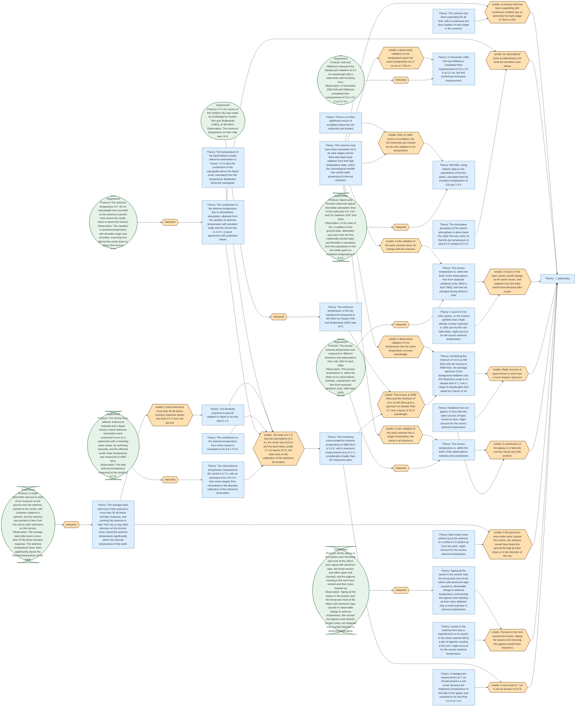

# Penzias-Wilson Holmdel horn antenna 1964-65

```mermaid
flowchart LR
  classDef theory fill:#dceeff,stroke:#315a78,stroke-width:1px
  classDef experiment fill:#e6f3e8,stroke:#39734a,stroke-width:1px
  classDef hyperedge fill:#ffe0b2,stroke:#76501e,stroke-width:2px
  t0["Theory: The total antenna temperature measured at the zenith is 6.7 K, with an estimated error of 0.3 K that comes largely from uncertainty in the absolute calibration of the reference termination."]:::theory
  t1["Theory: The contribution to the antenna temperature due to atmospheric absorption, obtained from the variation of antenna temperature with elevation angle and the secant law, is 2.3 K, in good agreement with published values."]:::theory
  t2["Theory: Taping all the seams in the section near the throat and most of the others with aluminum tape caused no observable change in antenna temperature, and evicting the pigeons and cleaning up their mess obtained only a small reduction in antenna temperature."]:::theory
  t3["Theory: The average back-lobe level of the antenna is more than 30 db below isotropic response, and pointing the antenna to New York City or any other direction on the horizon never raised the antenna temperature significantly above the thermal temperature of the earth."]:::theory
  t4["Theory: The excess temperature is, within the limits of the observations, isotropic and unpolarized."]:::theory
  t5["Theory: The excess temperature is, within the limits of the observations, free from seasonal variations (July 1964 to April 1965), and had not changed during almost a year."]:::theory
  t6["Theory: The minimum temperature of the sky background measured at 404 Mc/s by Pauliny-Toth and Shakeshaft (1962) was 16 K."]:::theory
  t7["Theory: In December 1965 Roll and Wilkinson completed their measurement of 3.0 ± 0.5 K at 3.2 cm, the first confirming microwave measurement."]:::theory
  t8["Theory: McKellar, using Adams' data on the populations of the two states, calculated that the excitation temperature of CN was 2.3 K."]:::theory
  t9["Theory: The backlobe response to ground radiation is taken to be less than 0.1 K."]:::theory
  t10["Theory: The remaining unaccounted-for antenna temperature at 4080 Mc/s is 3.5 K, with a maximum measurement error of 1 K, considerably smaller than the measured value."]:::theory
  t11["Theory: The contribution to the antenna temperature from ohmic losses is computed to be 0.8 ± 0.4 K."]:::theory
  t12["Theory: The temperature of the liquid-helium-cooled reference termination is known: 4.2 K plus the contribution of the waveguide above the liquid level, calculated from the temperature distribution along the waveguide."]:::theory
  t13["Theory: ⊥ (absurdity)"]:::theory
  t14["Theory: A background measurement at 7 cm should produce a null result, because the brightness temperature of the halo of the galaxy was expected to be less than 0.1 K at 7 cm."]:::theory
  t15["Theory: Combining the minimum of 16 K at 404 Mc/s with the excess at 4080 Mc/s, the average spectrum of the background radiation over this frequency range is no steeper than 0.7, over a range of wavelengths that varied by a factor of 10."]:::theory
  t16["Theory: Losses in the antenna horn due to imperfections in its seams, or the white material left by a pair of pigeons roosting in the horn, might account for the excess antenna temperature."]:::theory
  t17["Theory: Man-made noise picked up by the antenna, or a uniform 3 K picked up from the earth, might account for the excess antenna temperature."]:::theory
  t18["Theory: Radiation from our galaxy, or from discrete radio sources of types known to exist, might account for the excess antenna temperature."]:::theory
  t19["Theory: A source in the solar system, or the ionized particles that a high-altitude nuclear explosion in 1962 put into the Van Allen belts, might account for the excess antenna temperature."]:::theory
  t20["Theory: The microwave absorption of the earth's atmosphere is about twice the value that was used, so that the sky temperature is about 5 K instead of 2.5 K."]:::theory
  t21["Theory: The universe may have been extremely hot in its early stages and be filled with black-body radiation from that high-temperature state, which the cosmological redshift has cooled while preserving its thermal character."]:::theory
  t22["Theory: There is no other significant source of excitation where the CN molecules are located."]:::theory
  t23["Theory: The universe has been expanding for all time, with a continuous but slow creation of new matter in the universe."]:::theory
  x0(["Experiment<br/>Protocol: The 20-foot horn-reflector antenna at Holmdel and a liquid-helium-cooled reference termination were connected in turn to a radiometer with a traveling-wave maser, by switching manually, and the effective zenith noise temperature was measured at 4080 Mc/s.<br/>Observation: The total antenna temperature measured at the zenith is 6.7 K."]):::experiment
  x1(["Experiment<br/>Protocol: The antenna temperature at 7.35 cm wavelength was recorded as the antenna scanned from almost the zenith down to above the horizon.<br/>Observation: The variation in antenna temperature with elevation angle was recorded, scanning from almost the zenith down to above the horizon."]):::experiment
  x2(["Experiment<br/>Protocol: All the seams in the section near the throat and most of the others were taped with aluminum tape, the throat section was taken apart and checked, and the pigeons roosting in the horn were evicted and their mess cleaned up.<br/>Observation: Taping all the seams in the section near the throat and most of the others with aluminum tape caused no observable change in antenna temperature. We evicted the pigeons and cleaned up their mess, but obtained only a small reduction in antenna temperature."]):::experiment
  x3(["Experiment<br/>Protocol: A small transmitter was put in each of ten locations on the ground near the antenna, pointed to the zenith, with complete rotations in azimuth, and the antenna was pointed to New York City and to other directions on the horizon.<br/>Observation: The average back-lobe level is more than 30 db below isotropic response. The antenna temperature never went significantly above the thermal temperature of the earth."]):::experiment
  x4(["Experiment<br/>Protocol: The excess antenna temperature was measured in different directions and polarizations from July 1964 to April 1965.<br/>Observation: This excess temperature is, within the limits of our observations, isotropic, unpolarized, and free from seasonal variations (July, 1964-April, 1965)."]):::experiment
  x5(["Experiment<br/>Protocol: A 74 cm survey of the northern sky was made at Cambridge by Pauliny-Toth and Shakeshaft (1962), at 404 Mc/s.<br/>Observation: The minimum temperature on their map was 16 K."]):::experiment
  x6(["Experiment<br/>Protocol: Roll and Wilkinson measured the background radiation at 3.2 cm wavelength with a radiometer and receiving horn.<br/>Observation: In December 1965 Roll and Wilkinson completed their measurement of 3.0 ± 0.5 K at 3.2 cm."]):::experiment
  x7(["Experiment<br/>Protocol: Adams and Dunham observed optical interstellar absorption lines of the molecules CH, CH+ and CN, between 1937 and 1943.<br/>Observation: In the case of CN, in addition to the ground state, absorption was seen from the first rotationally excited state, and McKellar's calculation from the populations of the two states gave an excitation temperature of 2.3 K."]):::experiment
  h0{{"interprets"}}:::hyperedge
  x0 --> h0
  h0 --> t0
  h1{{"interprets"}}:::hyperedge
  x1 --> h1
  h1 --> t1
  h2{{"interprets"}}:::hyperedge
  x2 --> h2
  h2 --> t2
  h3{{"interprets"}}:::hyperedge
  x3 --> h3
  h3 --> t3
  h4{{"interprets"}}:::hyperedge
  x4 --> h4
  h4 --> t4
  h5{{"interprets"}}:::hyperedge
  x4 --> h5
  h5 --> t5
  h6{{"interprets"}}:::hyperedge
  x5 --> h6
  h6 --> t6
  h7{{"interprets"}}:::hyperedge
  x6 --> h7
  h7 --> t7
  h8{{"interprets"}}:::hyperedge
  x7 --> h8
  h8 --> t8
  h9{{"entails: A back-lobe level more than 30 db below isotropic response leaves less than 0.1 K from the ground."}}:::hyperedge
  t3 --> h9
  h9 --> t9
  h10{{"entails: The total of 6.7 K less the atmosphere (2.3 K), the ohmic loss (0.8 K) and the back lobes (under 0.1 K) leaves 3.5 K; the total rests on the calibration of the reference termination."}}:::hyperedge
  t0 --> h10
  t1 --> h10
  t11 --> h10
  t9 --> h10
  t12 --> h10
  h10 --> t10
  h11{{"entails: A null result at 7 cm is not an excess of 3.5 K."}}:::hyperedge
  t14 --> h11
  t10 --> h11
  h11 --> t13
  h12{{"entails: The excess at 4080 Mc/s and the minimum of 16 K at 404 Mc/s give a spectrum no steeper than 0.7 over a factor of 10 in wavelength."}}:::hyperedge
  t10 --> h12
  t6 --> h12
  h12 --> t15
  h13{{"entails: If losses in the horn caused the excess, taping the seams and removing the pigeons would have lowered it."}}:::hyperedge
  t16 --> h13
  t2 --> h13
  h13 --> t13
  h14{{"entails: If the ground or man-made noise caused the excess, the antenna would have heard the ground through its back lobes or in the direction of the city."}}:::hyperedge
  t17 --> h14
  t3 --> h14
  h14 --> t13
  h15{{"entails: A contribution of the galaxy or of discrete sources would vary with position."}}:::hyperedge
  t18 --> h15
  t4 --> h15
  h15 --> t13
  h16{{"entails: Radio sources of types known to exist have a much steeper spectrum."}}:::hyperedge
  t18 --> h16
  t15 --> h16
  h16 --> t13
  h17{{"entails: A source in the solar system would change as the earth moves, and radiation from the belts would have decayed after a year."}}:::hyperedge
  t19 --> h17
  t5 --> h17
  h17 --> t13
  h18{{"entails: An atmosphere twice as absorbing is not what the elevation scan shows."}}:::hyperedge
  t20 --> h18
  t1 --> h18
  h18 --> t13
  h19{{"entails: A relic radiation of the early universe has a single temperature, the same in all directions."}}:::hyperedge
  t21 --> h19
  h19 --> t4
  h20{{"entails: A relic radiation of the early universe does not change with the seasons."}}:::hyperedge
  t21 --> h20
  h20 --> t5
  h21{{"entails: A black-body radiation of one temperature has the same temperature at every wavelength."}}:::hyperedge
  t21 --> h21
  h21 --> t15
  h22{{"entails: A black-body radiation of one temperature gives the same temperature at 3.2 cm as at 7.35 cm."}}:::hyperedge
  t21 --> h22
  h22 --> t7
  h23{{"entails: With no other source of excitation, the CN molecules are excited by the relic radiation to its temperature."}}:::hyperedge
  t21 --> h23
  t22 --> h23
  h23 --> t8
  h24{{"entails: A universe that has been expanding with continuous creation has no extremely hot early stage to leave a relic."}}:::hyperedge
  t23 --> h24
  t21 --> h24
  h24 --> t13
```
