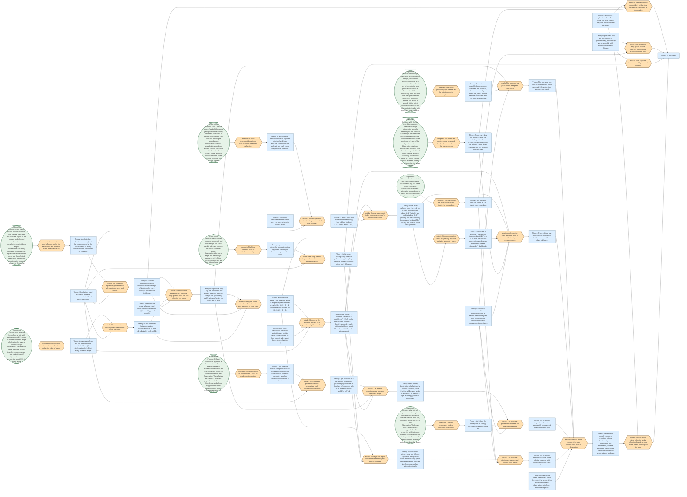

# Rainbow

```mermaid
flowchart LR
  classDef theory fill:#dceeff,stroke:#315a78,stroke-width:1px
  classDef experiment fill:#e6f3e8,stroke:#39734a,stroke-width:1px
  classDef hyperedge fill:#ffe0b2,stroke:#76501e,stroke-width:2px
  t0["Theory: A reflected ray makes the same angle with the surface normal as the incident ray, for every colour, and lies in the plane of incidence."]:::theory
  t1["Theory: A ray passing from air into water satisfies sin(incidence) / sin(refraction) = 1.33 at every incidence angle."]:::theory
  t2["Theory: In a glass prism, different colours of light are refracted by different amounts, violet most and red least, and each colour keeps its own refraction."]:::theory
  t3["Theory: Light reflected from a transparent surface is polarised perpendicular to the plane of incidence, completely so when tan(angle of incidence) = n2 / n1."]:::theory
  t4["Theory: Light from two close slits forms alternating bright and dark fringes whose spacing depends on colour."]:::theory
  t5["Theory: Colour from a water-filled sphere comes from rays that refract in, reflect once internally and refract out, with a second, reversed-colour set from two internal reflections."]:::theory
  t6["Theory: The primary bow lies about 42° from the antisolar point with red outside; the secondary bow lies about 51° from it with red inside; the sky between them is darker."]:::theory
  t7["Theory: Light from the primary bow is strongly polarised tangentially to the arc."]:::theory
  t8["Theory: Faint repeating coloured bands lie just inside the primary bow."]:::theory
  t9["Theory: At a smooth surface the angle of reflection equals the angle of incidence for every colour, in the plane of incidence."]:::theory
  t10["Theory: Regularities found in careful, repeated measurements hold in all similar situations."]:::theory
  t11["Theory: At the boundary between media of refractive indices n1 and n2, n1 sin(θ1) = n2 sin(θ2)."]:::theory
  t12["Theory: In water, violet light is refracted more strongly than red light (n about 1.343 versus about 1.331)."]:::theory
  t13["Theory: The colour dependence of refraction seen in a glass prism also holds in water."]:::theory
  t14["Theory: Light reflected at a transparent boundary is polarised perpendicular to the plane of incidence, fully so at Brewster's angle, tan(θB) = n2 / n1."]:::theory
  t15["Theory: Light waves arriving along different paths add up, giving bright and dark fringes according to their path difference."]:::theory
  t16["Theory: In a spherical drop, a ray can leave after one internal reflection (primary path) or two (secondary path), with a refraction on entry and on exit."]:::theory
  t17["Theory: Raindrops are nearly spherical, much larger than the wavelength of light, and lit by parallel sunlight."]:::theory
  t18["Theory: With incidence angle i and refraction angle r, the primary path deviates a ray by D = 180° + 2i − 4r and the secondary path by D = 360° + 2i − 6r."]:::theory
  t19["Theory: For n about 1.33, deviation is minimal at cos²(i) = (n² − 1) / 3 on the primary path and (n² − 1) / 8 on the secondary path, putting bright bows about 42° and about 51° from the antisolar point."]:::theory
  t20["Theory: Rays whose deviation is stationary against impact position leave nearly parallel, so light intensity piles up at the minimum deviation angle."]:::theory
  t21["Theory: Since violet refracts more than red, the primary bow has red at about 42.4° (outside) and violet at about 40.6° (inside), and the secondary bow has red at about 50.4° (inside) and violet at about 53.5° (outside)."]:::theory
  t22["Theory: No primary or secondary ray reaches between about 42.4° and 50.4° from the antisolar point, so the sky between the bows is darker (Alexander's dark band)."]:::theory
  t23["Theory: At the primary bow's internal reflection the angle is about 40°, near the internal Brewster angle of about 37°, so the bow's light is strongly polarised tangentially."]:::theory
  t24["Theory: Just inside the primary bow, two different rays leave a drop in the same direction along paths of different length, and their interference gives faint alternating bands."]:::theory
  t25["Theory: The one- and two-internal-reflection ray paths agree with the water-filled sphere experiment."]:::theory
  t26["Theory: A model is corroborated by an observation when its derived prediction agrees with the interpreted observation within measurement uncertainty."]:::theory
  t27["Theory: The predicted bow angles, colour orders and dark band agree with the observed bows."]:::theory
  t28["Theory: The predicted tangential polarisation agrees with the observed polarisation of the bow."]:::theory
  t29["Theory: The predicted interference bands agree with the observed faint bands inside the primary bow."]:::theory
  t30["Theory: The raindrop model, combining refraction, internal reflection, dispersion, polarisation and interference, is better supported than a simple mirror reflection as the explanation of rainbows."]:::theory
  t31["Theory: Between these stated alternatives, prefer the model that accounts for more independent observations with fewer extra assumptions."]:::theory
  t32["Theory: ⊥ (absurdity)"]:::theory
  t33["Theory: A rainbow is a simple mirror-like reflection of the Sun from cloud or mist, with no refraction in the drops."]:::theory
  t34["Theory: Light travels only as non-interfering geometric rays, so intensity varies smoothly with deviation and has no fringes."]:::theory
  x0(["Experiment<br/>Protocol: Send narrow beams of several colours onto a plane mirror and measure the angles of the incident and reflected beams from the surface normal at several incidence angles.<br/>Observation: For every colour the two angles are equal within measurement error, and the reflected beam stays in the plane containing the incident beam and the normal."]):::experiment
  x1(["Experiment<br/>Protocol: Send a narrow beam from air into still water and record the angle of incidence and the angle of refraction for several incidence angles.<br/>Observation: The refraction angle is always smaller than the incidence angle, and sin(incidence) / sin(refraction) stays constant at about 1.33 for every angle."]):::experiment
  x2(["Experiment<br/>Protocol: Pass a narrow beam of sunlight through a glass prism onto a screen, then select one colour of the spread beam with a slit and send it through a second prism.<br/>Observation: Sunlight spreads into an ordered band of colours with violet deviated most and red least; a single selected colour is deviated by the second prism but not spread further."]):::experiment
  x3(["Experiment<br/>Protocol: Reflect unpolarised light from a glass or water surface at different angles of incidence and examine the reflected beam through a rotating polarising filter.<br/>Observation: The reflected light is partly polarised perpendicular to the plane of incidence, and almost fully polarised at the incidence angle where tan(angle) equals n2 / n1."]):::experiment
  x4(["Experiment<br/>Protocol: Pass sunlight through a narrow slit and then through two close parallel slits, and observe the light on a distant screen.<br/>Observation: Alternating bright and dark fringes appear, and the fringe spacing is larger for red light than for violet light."]):::experiment
  x5(["Experiment<br/>Protocol: Hold a large water-filled glass sphere in sunlight, view it from different directions, and cover parts of its surface to see which entering rays produce which colours.<br/>Observation: Colours appear only from rays that enter the sphere, reflect once off its back inner surface and leave; a second, fainter set of colours comes from rays reflected twice inside, with the colour order reversed."]):::experiment
  x6(["Experiment<br/>Protocol: With the Sun behind the observer, measure the angle between the antisolar direction (the line from the Sun through the observer's head) and the bright bows, and note their colour order and the brightness of the sky between them.<br/>Observation: A primary bow is seen about 42° from the antisolar point with red on the outside; a fainter secondary bow appears about 51° from it with the colours reversed, and the sky between the two bows is darker."]):::experiment
  x7(["Experiment<br/>Protocol: View a bright primary bow through a polarising filter and rotate the filter through a full turn, noting the brightness of the bow.<br/>Observation: The bow's brightness changes strongly with the filter angle: it is brightest when the filter's transmission axis is tangent to the arc and nearly vanishes when the axis points along the radius."]):::experiment
  x8(["Experiment<br/>Protocol: In rain made of small, fairly uniform drops, examine the sky just inside the primary bow.<br/>Observation: A few faint, alternating pink and green bands are seen just inside the primary bow."]):::experiment
  h0{{"interprets: Equal incidence and reflection angles for each colour are recorded as the measured result."}}:::hyperedge
  x0 --> h0
  h0 --> t0
  h1{{"interprets: The constant sine ratio is read as the refractive index of water."}}:::hyperedge
  x1 --> h1
  h1 --> t1
  h2{{"interprets: Colour-dependent deviation is read as colour-dependent refraction."}}:::hyperedge
  x2 --> h2
  h2 --> t2
  h3{{"interprets: The polarisation of reflected light is read as a rule about reflection."}}:::hyperedge
  x3 --> h3
  h3 --> t3
  h4{{"interprets: The fringe pattern is read as interference of light."}}:::hyperedge
  x4 --> h4
  h4 --> t4
  h5{{"interprets: The colour-producing rays are read as the path through the sphere."}}:::hyperedge
  x5 --> h5
  h5 --> t5
  h6{{"interprets: The measured angles, colour order and dark band are recorded as the bow geometry."}}:::hyperedge
  x6 --> h6
  h6 --> t6
  h7{{"interprets: The filter response is read as tangential polarisation."}}:::hyperedge
  x7 --> h7
  h7 --> t7
  h8{{"interprets: The faint bands are read as extra bows inside the primary bow."}}:::hyperedge
  x8 --> h8
  h8 --> t8
  h9{{"entails: The measured equality is generalised to all smooth surfaces and colours."}}:::hyperedge
  t0 --> h9
  t10 --> h9
  h9 --> t9
  h10{{"entails: The constant sine ratio is generalised into the law of refraction."}}:::hyperedge
  t1 --> h10
  t10 --> h10
  h10 --> t11
  h11{{"entails: Colour-dependent refraction in glass is carried over to water."}}:::hyperedge
  t2 --> h11
  t13 --> h11
  t10 --> h11
  h11 --> t12
  h12{{"entails: The measured polarisation rule is generalised to all transparent boundaries."}}:::hyperedge
  t3 --> h12
  t10 --> h12
  h12 --> t14
  h13{{"entails: The fringe pattern is generalised into a wave-interference law."}}:::hyperedge
  t4 --> h13
  t10 --> h13
  h13 --> t15
  h14{{"entails: Reflection and refraction at a spherical drop give the one- and two-reflection exit paths."}}:::hyperedge
  t9 --> h14
  t11 --> h14
  t17 --> h14
  h14 --> t16
  h15{{"entails: Adding the bends at each surface gives the total deviation of each path."}}:::hyperedge
  t16 --> h15
  t9 --> h15
  t11 --> h15
  h15 --> t18
  h16{{"entails: Minimising the deviation with n = 1.33 gives the bright bow angles."}}:::hyperedge
  t18 --> h16
  t20 --> h16
  t1 --> h16
  h16 --> t19
  h17{{"entails: A colour-dependent index moves each colour's minimum deviation."}}:::hyperedge
  t19 --> h17
  t12 --> h17
  h17 --> t21
  h18{{"entails: Minimum deviation stops the primary rays and starts the secondary ones."}}:::hyperedge
  t18 --> h18
  t21 --> h18
  h18 --> t22
  h19{{"entails: The internal reflection angle sits near Brewster's angle."}}:::hyperedge
  t14 --> h19
  t16 --> h19
  t19 --> h19
  h19 --> t23
  h20{{"entails: Two rays with equal deviation but different path lengths interfere."}}:::hyperedge
  t18 --> h20
  t19 --> h20
  t15 --> h20
  h20 --> t24
  h21{{"entails: The predicted ray paths match the sphere experiment."}}:::hyperedge
  t16 --> h21
  t5 --> h21
  t26 --> h21
  h21 --> t25
  h22{{"entails: Angles, colour order and dark band all match the sky measurements."}}:::hyperedge
  t19 --> h22
  t21 --> h22
  t22 --> h22
  t6 --> h22
  t26 --> h22
  h22 --> t27
  h23{{"entails: The predicted polarisation matches the filter measurement."}}:::hyperedge
  t23 --> h23
  t7 --> h23
  t26 --> h23
  h23 --> t28
  h24{{"entails: The predicted interference bands match the faint inner bands."}}:::hyperedge
  t24 --> h24
  t8 --> h24
  t26 --> h24
  h24 --> t29
  h25{{"entails: One drop model accounts for four independent kinds of observation."}}:::hyperedge
  t25 --> h25
  t27 --> h25
  t28 --> h25
  t29 --> h25
  t31 --> h25
  h25 --> t30
  h26{{"entails: A pure reflection is colour-blind, yet the bow shows ordered colours at fixed angles."}}:::hyperedge
  t33 --> h26
  t9 --> h26
  t6 --> h26
  h26 --> t32
  h27{{"entails: Non-interfering rays give a smooth intensity with no extra bands inside the bow."}}:::hyperedge
  t34 --> h27
  t8 --> h27
  h27 --> t32
  h28{{"entails: Pure rays and interference of light cannot both hold."}}:::hyperedge
  t34 --> h28
  t15 --> h28
  h28 --> t32
  h29{{"entails: A colour-blind mirror reflection and a refraction-based raindrop model cannot both explain the bow."}}:::hyperedge
  t33 --> h29
  t30 --> h29
  h29 --> t32
```
