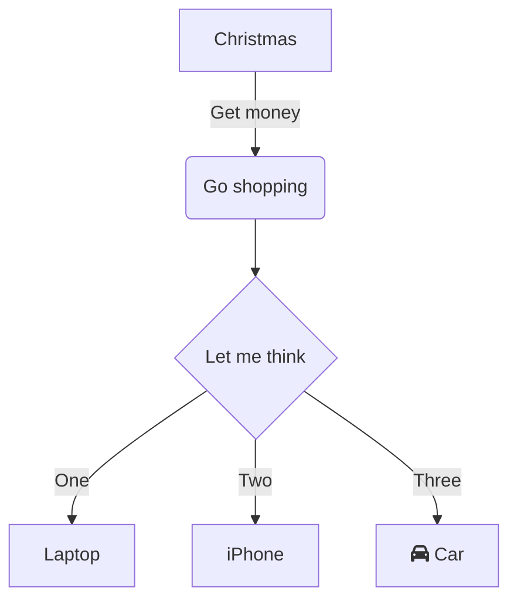
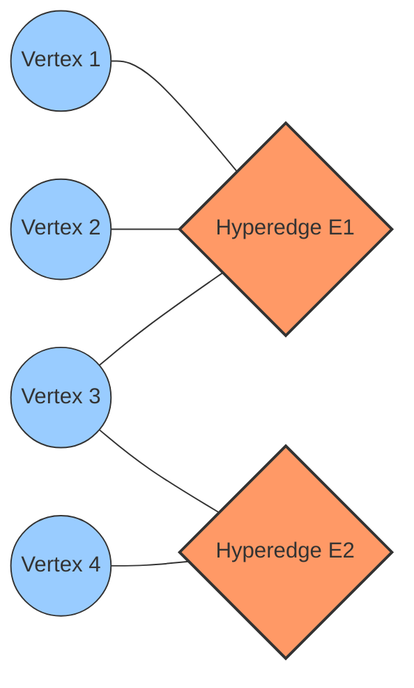

```mermaid
flowchart TD
    A[Christmas] -->|Get money| B(Go shopping)
    B --> C{Let me think}
    C -->|One| D[Laptop]
    C -->|Two| E[iPhone]
    C -->|Three| F[fa:fa-car Car]
```

Hypergraph can be shown by displaying hyperedges as vertices.

```mermaid
flowchart LR
    %% Vertices
    v1((Vertex 1))
    v2((Vertex 2))
    v3((Vertex 3))
    v4((Vertex 4))

    %% Hyperedges (Acting as bridges)
    e1{Hyperedge E1}
    e2{Hyperedge E2}

    %% E1 connects v1, v2, and v3
    v1 --- e1
    v2 --- e1
    v3 --- e1

    %% E2 connects v3 and v4
    v3 --- e2
    v4 --- e2

    %% Styling to visually separate components
    classDef hyperedge fill:#f96,stroke:#333,stroke-width:2px;
    classDef vertex fill:#9cf,stroke:#333,stroke-width:1px;
    class e1,e2 hyperedge;
    class v1,v2,v3,v4 vertex;
```