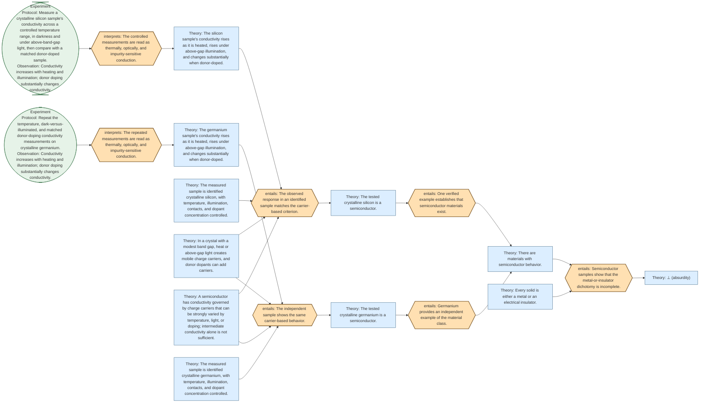

# Semiconductor

```mermaid
flowchart LR
  classDef theory fill:#dceeff,stroke:#315a78,stroke-width:1px
  classDef experiment fill:#e6f3e8,stroke:#39734a,stroke-width:1px
  classDef hyperedge fill:#ffe0b2,stroke:#76501e,stroke-width:2px
  t0["Theory: The silicon sample's conductivity rises as it is heated, rises under above-gap illumination, and changes substantially when donor-doped."]:::theory
  t1["Theory: The germanium sample's conductivity rises as it is heated, rises under above-gap illumination, and changes substantially when donor-doped."]:::theory
  t2["Theory: The tested crystalline silicon is a semiconductor."]:::theory
  t3["Theory: The measured sample is identified crystalline silicon, with temperature, illumination, contacts, and dopant concentration controlled."]:::theory
  t4["Theory: In a crystal with a modest band gap, heat or above-gap light creates mobile charge carriers, and donor dopants can add carriers."]:::theory
  t5["Theory: A semiconductor has conductivity governed by charge carriers that can be strongly varied by temperature, light, or doping; intermediate conductivity alone is not sufficient."]:::theory
  t6["Theory: The tested crystalline germanium is a semiconductor."]:::theory
  t7["Theory: The measured sample is identified crystalline germanium, with temperature, illumination, contacts, and dopant concentration controlled."]:::theory
  t8["Theory: There are materials with semiconductor behavior."]:::theory
  t9["Theory: ⊥ (absurdity)"]:::theory
  t10["Theory: Every solid is either a metal or an electrical insulator."]:::theory
  x0(["Experiment<br/>Protocol: Measure a crystalline silicon sample's conductivity across a controlled temperature range, in darkness and under above-band-gap light, then compare with a matched donor-doped sample.<br/>Observation: Conductivity increases with heating and illumination; donor doping substantially changes conductivity."]):::experiment
  x1(["Experiment<br/>Protocol: Repeat the temperature, dark-versus-illuminated, and matched donor-doping conductivity measurements on crystalline germanium.<br/>Observation: Conductivity increases with heating and illumination; donor doping substantially changes conductivity."]):::experiment
  h0{{"interprets: The controlled measurements are read as thermally, optically, and impurity-sensitive conduction."}}:::hyperedge
  x0 --> h0
  h0 --> t0
  h1{{"interprets: The repeated measurements are read as thermally, optically, and impurity-sensitive conduction."}}:::hyperedge
  x1 --> h1
  h1 --> t1
  h2{{"entails: The observed response in an identified sample matches the carrier-based criterion."}}:::hyperedge
  t0 --> h2
  t3 --> h2
  t4 --> h2
  t5 --> h2
  h2 --> t2
  h3{{"entails: The independent sample shows the same carrier-based behavior."}}:::hyperedge
  t1 --> h3
  t7 --> h3
  t4 --> h3
  t5 --> h3
  h3 --> t6
  h4{{"entails: One verified example establishes that semiconductor materials exist."}}:::hyperedge
  t2 --> h4
  h4 --> t8
  h5{{"entails: Germanium provides an independent example of the material class."}}:::hyperedge
  t6 --> h5
  h5 --> t8
  h6{{"entails: Semiconductor samples show that the metal-or-insulator dichotomy is incomplete."}}:::hyperedge
  t10 --> h6
  t8 --> h6
  h6 --> t9
```
