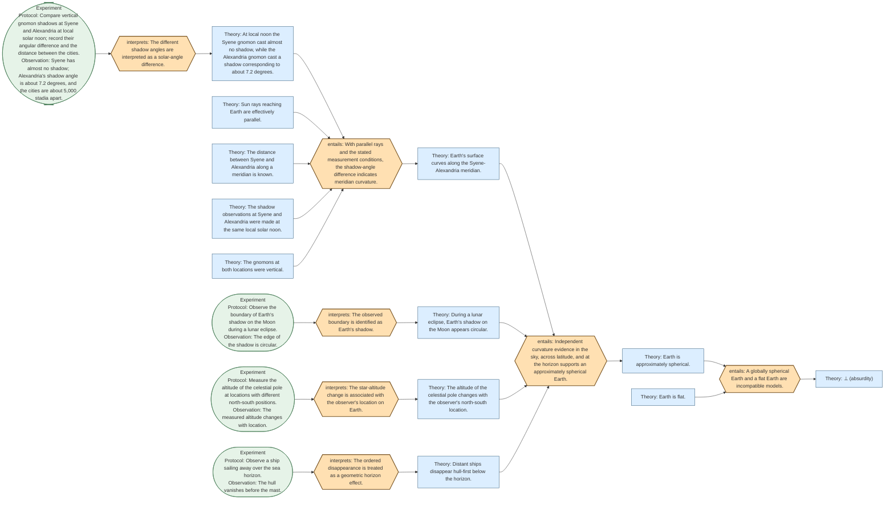

# Shape of Earth

```mermaid
flowchart LR
  classDef theory fill:#dceeff,stroke:#315a78,stroke-width:1px
  classDef experiment fill:#e6f3e8,stroke:#39734a,stroke-width:1px
  classDef hyperedge fill:#ffe0b2,stroke:#76501e,stroke-width:2px
  t0["Theory: At local noon the Syene gnomon cast almost no shadow, while the Alexandria gnomon cast a shadow corresponding to about 7.2 degrees."]:::theory
  t1["Theory: Earth's surface curves along the Syene-Alexandria meridian."]:::theory
  t2["Theory: Sun rays reaching Earth are effectively parallel."]:::theory
  t3["Theory: The distance between Syene and Alexandria along a meridian is known."]:::theory
  t4["Theory: The shadow observations at Syene and Alexandria were made at the same local solar noon."]:::theory
  t5["Theory: The gnomons at both locations were vertical."]:::theory
  t6["Theory: During a lunar eclipse, Earth's shadow on the Moon appears circular."]:::theory
  t7["Theory: The altitude of the celestial pole changes with the observer's north-south location."]:::theory
  t8["Theory: Distant ships disappear hull-first below the horizon."]:::theory
  t9["Theory: Earth is approximately spherical."]:::theory
  t10["Theory: ⊥ (absurdity)"]:::theory
  t11["Theory: Earth is flat."]:::theory
  x0(["Experiment<br/>Protocol: Compare vertical gnomon shadows at Syene and Alexandria at local solar noon; record their angular difference and the distance between the cities.<br/>Observation: Syene has almost no shadow; Alexandria's shadow angle is about 7.2 degrees, and the cities are about 5,000 stadia apart."]):::experiment
  x1(["Experiment<br/>Protocol: Observe the boundary of Earth's shadow on the Moon during a lunar eclipse.<br/>Observation: The edge of the shadow is circular."]):::experiment
  x2(["Experiment<br/>Protocol: Measure the altitude of the celestial pole at locations with different north-south positions.<br/>Observation: The measured altitude changes with location."]):::experiment
  x3(["Experiment<br/>Protocol: Observe a ship sailing away over the sea horizon.<br/>Observation: The hull vanishes before the mast."]):::experiment
  h0{{"interprets: The different shadow angles are interpreted as a solar-angle difference."}}:::hyperedge
  x0 --> h0
  h0 --> t0
  h1{{"entails: With parallel rays and the stated measurement conditions, the shadow-angle difference indicates meridian curvature."}}:::hyperedge
  t0 --> h1
  t2 --> h1
  t3 --> h1
  t4 --> h1
  t5 --> h1
  h1 --> t1
  h2{{"interprets: The observed boundary is identified as Earth's shadow."}}:::hyperedge
  x1 --> h2
  h2 --> t6
  h3{{"interprets: The star-altitude change is associated with the observer's location on Earth."}}:::hyperedge
  x2 --> h3
  h3 --> t7
  h4{{"interprets: The ordered disappearance is treated as a geometric horizon effect."}}:::hyperedge
  x3 --> h4
  h4 --> t8
  h5{{"entails: Independent curvature evidence in the sky, across latitude, and at the horizon supports an approximately spherical Earth."}}:::hyperedge
  t1 --> h5
  t6 --> h5
  t7 --> h5
  t8 --> h5
  h5 --> t9
  h6{{"entails: A globally spherical Earth and a flat Earth are incompatible models."}}:::hyperedge
  t9 --> h6
  t11 --> h6
  h6 --> t10
```
