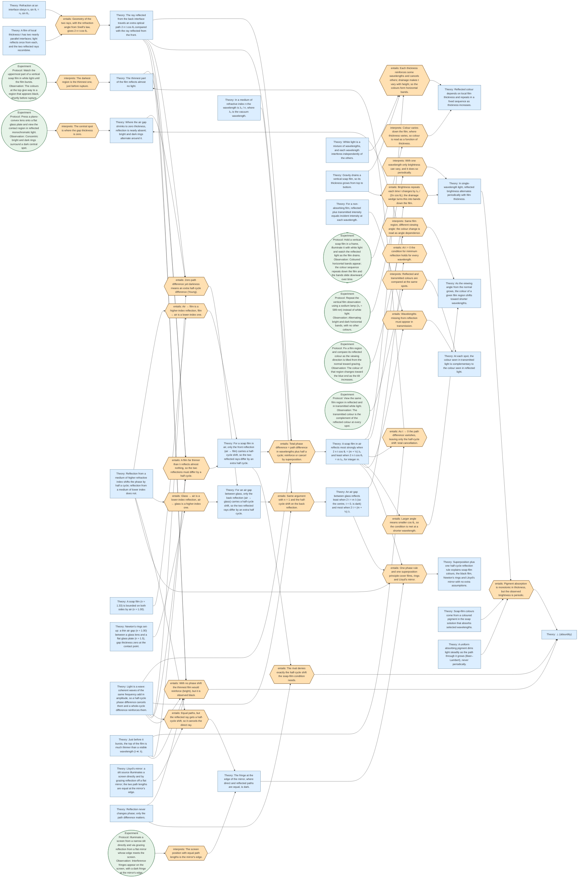

# Colours in soap films

```mermaid
flowchart LR
  classDef theory fill:#dceeff,stroke:#315a78,stroke-width:1px
  classDef experiment fill:#e6f3e8,stroke:#39734a,stroke-width:1px
  classDef hyperedge fill:#ffe0b2,stroke:#76501e,stroke-width:2px
  t0["Theory: Reflected colour depends on local film thickness and repeats in a fixed sequence as thickness increases."]:::theory
  t1["Theory: In single-wavelength light, reflected brightness alternates periodically with film thickness."]:::theory
  t2["Theory: The thinnest part of the film reflects almost no light."]:::theory
  t3["Theory: As the viewing angle from the normal grows, the colour of a given film region shifts toward shorter wavelengths."]:::theory
  t4["Theory: Where the air gap shrinks to zero thickness, reflection is nearly absent; bright and dark rings alternate around it."]:::theory
  t5["Theory: At each spot, the colour seen in transmitted light is complementary to the colour seen in reflected light."]:::theory
  t6["Theory: The fringe at the edge of the mirror, where direct and reflected paths are equal, is dark."]:::theory
  t7["Theory: The ray reflected from the back interface travels an extra optical path 2 n t cos θₜ compared with the ray reflected from the front."]:::theory
  t8["Theory: Refraction at an interface obeys n₁ sin θ₁ = n₂ sin θ₂."]:::theory
  t9["Theory: A film of local thickness t has two nearly parallel interfaces; light reflects once from each, and the two reflected rays recombine."]:::theory
  t10["Theory: For a soap film in air, only the front reflection (air → film) carries a half-cycle shift, so the two reflected rays differ by an extra half cycle."]:::theory
  t11["Theory: Reflection from a medium of higher refractive index shifts the phase by half a cycle; reflection from a medium of lower index does not."]:::theory
  t12["Theory: A soap film (n ≈ 1.33) is bounded on both sides by air (n ≈ 1.00)."]:::theory
  t13["Theory: For an air gap between glass, only the back reflection (air → glass) carries a half-cycle shift, so the two reflected rays differ by an extra half cycle."]:::theory
  t14["Theory: Newton's rings set-up: a thin air gap (n ≈ 1.00) between a glass lens and a flat glass plate (n ≈ 1.5), gap thickness zero at the contact point."]:::theory
  t15["Theory: A soap film in air reflects most strongly when 2 n t cos θₜ = (m + ½) λ₀ and least when 2 n t cos θₜ = m λ₀, for integer m."]:::theory
  t16["Theory: Light is a wave: coherent waves of the same frequency add in amplitude, so a half-cycle phase difference cancels them and a whole-cycle difference reinforces them."]:::theory
  t17["Theory: In a medium of refractive index n the wavelength is λ₀ / n, where λ₀ is the vacuum wavelength."]:::theory
  t18["Theory: An air gap between glass reflects least when 2 t = m λ (so the centre, t = 0, is dark) and most when 2 t = (m + ½) λ."]:::theory
  t19["Theory: White light is a mixture of wavelengths, and each wavelength interferes independently of the others."]:::theory
  t20["Theory: Gravity drains a vertical soap film, so its thickness grows from top to bottom."]:::theory
  t21["Theory: Just before it bursts, the top of the film is much thinner than a visible wavelength (t ≪ λ)."]:::theory
  t22["Theory: For a non-absorbing film, reflected plus transmitted intensity equals incident intensity at each wavelength."]:::theory
  t23["Theory: Lloyd's mirror: a slit source illuminates a screen directly and by grazing reflection off a flat mirror; the two path lengths are equal at the mirror's edge."]:::theory
  t24["Theory: Superposition plus one half-cycle reflection rule explains soap-film colours, the black film, Newton's rings and Lloyd's mirror with no extra assumptions."]:::theory
  t25["Theory: ⊥ (absurdity)"]:::theory
  t26["Theory: Soap-film colours come from a coloured pigment in the soap solution that absorbs selected wavelengths."]:::theory
  t27["Theory: A uniform absorbing pigment dims light steadily as the path through it grows (Beer–Lambert), never periodically."]:::theory
  t28["Theory: Reflection never changes phase; only the path difference matters."]:::theory
  x0(["Experiment<br/>Protocol: Hold a vertical soap film in a frame, illuminate it with white light and watch the reflected light as the film drains.<br/>Observation: Coloured horizontal bands appear; the colour sequence repeats down the film and the bands slide downward over time."]):::experiment
  x1(["Experiment<br/>Protocol: Repeat the vertical film observation using a sodium lamp (λ₀ ≈ 589 nm) instead of white light.<br/>Observation: Alternating bright and dark horizontal bands, with no other colours."]):::experiment
  x2(["Experiment<br/>Protocol: Watch the uppermost part of a vertical soap film in white light until the film bursts.<br/>Observation: The colours at the top give way to a region that appears black, shortly before rupture."]):::experiment
  x3(["Experiment<br/>Protocol: Fix a film region and compare its reflected colour as the viewing direction is tilted from the normal toward grazing.<br/>Observation: The colour of that region changes toward the blue end as the tilt increases."]):::experiment
  x4(["Experiment<br/>Protocol: Press a plano-convex lens onto a flat glass plate and view the contact region in reflected monochromatic light.<br/>Observation: Concentric bright and dark rings surround a dark central spot."]):::experiment
  x5(["Experiment<br/>Protocol: View the same film region in reflected and in transmitted white light.<br/>Observation: The transmitted colour is the complement of the reflected colour at every spot."]):::experiment
  x6(["Experiment<br/>Protocol: Illuminate a screen from a narrow slit directly and via grazing reflection from a flat mirror whose edge meets the screen.<br/>Observation: Interference fringes appear on the screen, with a dark fringe at the mirror's edge."]):::experiment
  h0{{"interprets: Colour varies down the film, where thickness varies, so colour is read as a function of thickness."}}:::hyperedge
  x0 --> h0
  h0 --> t0
  h1{{"interprets: With one wavelength only brightness can vary, and it does so periodically."}}:::hyperedge
  x1 --> h1
  h1 --> t1
  h2{{"interprets: The darkest region is the thinnest one, just before rupture."}}:::hyperedge
  x2 --> h2
  h2 --> t2
  h3{{"interprets: Same film region, different viewing angle: the colour change is read as angle dependence."}}:::hyperedge
  x3 --> h3
  h3 --> t3
  h4{{"interprets: The central spot is where the gap thickness is zero."}}:::hyperedge
  x4 --> h4
  h4 --> t4
  h5{{"interprets: Reflected and transmitted colours are compared at the same spots."}}:::hyperedge
  x5 --> h5
  h5 --> t5
  h6{{"interprets: The screen position with equal path lengths is the mirror's edge."}}:::hyperedge
  x6 --> h6
  h6 --> t6
  h7{{"entails: Geometry of the two rays, with the refraction angle from Snell's law, gives 2 n t cos θₜ."}}:::hyperedge
  t8 --> h7
  t9 --> h7
  h7 --> t7
  h8{{"entails: Air → film is a higher-index reflection, film → air is a lower-index one."}}:::hyperedge
  t11 --> h8
  t12 --> h8
  h8 --> t10
  h9{{"entails: Glass → air is a lower-index reflection, air → glass is a higher-index one."}}:::hyperedge
  t11 --> h9
  t14 --> h9
  h9 --> t13
  h10{{"entails: Total phase difference = path difference in wavelengths plus half a cycle; reinforce or cancel by superposition."}}:::hyperedge
  t16 --> h10
  t7 --> h10
  t17 --> h10
  t10 --> h10
  h10 --> t15
  h11{{"entails: Same argument with n = 1 and the half-cycle shift on the back reflection."}}:::hyperedge
  t16 --> h11
  t7 --> h11
  t13 --> h11
  h11 --> t18
  h12{{"entails: Each thickness reinforces some wavelengths and cancels others; drainage makes t vary with height, so the colours form horizontal bands."}}:::hyperedge
  t15 --> h12
  t19 --> h12
  t20 --> h12
  h12 --> t0
  h13{{"entails: Brightness repeats each time t changes by λ₀ / (2n cos θₜ); the drainage wedge turns this into bands down the film."}}:::hyperedge
  t15 --> h13
  t20 --> h13
  h13 --> t1
  h14{{"entails: As t → 0 the path difference vanishes, leaving only the half-cycle shift: total cancellation."}}:::hyperedge
  t15 --> h14
  t21 --> h14
  h14 --> t2
  h15{{"entails: Larger angle means smaller cos θₜ, so the condition is met at a shorter wavelength."}}:::hyperedge
  t15 --> h15
  h15 --> t3
  h16{{"entails: At t = 0 the condition for minimum reflection holds for every wavelength."}}:::hyperedge
  t18 --> h16
  h16 --> t4
  h17{{"entails: Wavelengths missing from reflection must appear in transmission."}}:::hyperedge
  t15 --> h17
  t22 --> h17
  h17 --> t5
  h18{{"entails: Equal paths, but the reflected ray gets a half-cycle shift, so it cancels the direct ray."}}:::hyperedge
  t16 --> h18
  t11 --> h18
  t23 --> h18
  h18 --> t6
  h19{{"entails: Zero path difference yet darkness means an extra half-cycle difference (Young)."}}:::hyperedge
  t4 --> h19
  t16 --> h19
  t7 --> h19
  h19 --> t13
  h20{{"entails: A film far thinner than λ reflects almost nothing, so the two reflections must differ by a half cycle."}}:::hyperedge
  t2 --> h20
  t21 --> h20
  t16 --> h20
  t7 --> h20
  h20 --> t10
  h21{{"entails: One phase rule and one superposition principle cover films, rings and Lloyd's mirror."}}:::hyperedge
  t15 --> h21
  t18 --> h21
  t11 --> h21
  t6 --> h21
  h21 --> t24
  h22{{"entails: Pigment absorption is monotonic in thickness, but the observed brightness is periodic."}}:::hyperedge
  t26 --> h22
  t27 --> h22
  t1 --> h22
  h22 --> t25
  h23{{"entails: With no phase shift the thinnest film would reinforce (bright), but it is observed black."}}:::hyperedge
  t28 --> h23
  t16 --> h23
  t7 --> h23
  t21 --> h23
  t2 --> h23
  h23 --> t25
  h24{{"entails: The rival denies exactly the half-cycle shift the soap-film condition needs."}}:::hyperedge
  t28 --> h24
  t10 --> h24
  h24 --> t25
```
