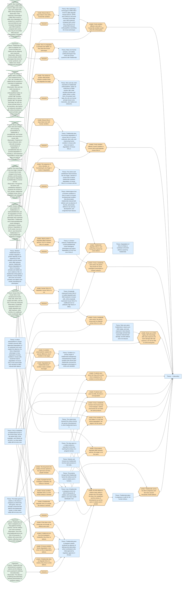

# Thalidomide across species

```mermaid
flowchart LR
  classDef theory fill:#dceeff,stroke:#315a78,stroke-width:1px
  classDef experiment fill:#e6f3e8,stroke:#39734a,stroke-width:1px
  classDef hyperedge fill:#ffe0b2,stroke:#76501e,stroke-width:2px
  t0["Theory: Thalidomide given to pregnant rodents produced an absence of defining limb deformities, which contributed to the initial approval by regulatory agencies in Europe."]:::theory
  t1["Theory: Use of thalidomide in pregnancy led to the birth of thousands of children with severe birth defects, more than 10,000 individuals in all."]:::theory
  t2["Theory: Many non-human primates, and rabbits, exhibit phenotypes that mimic the human syndrome after thalidomide."]:::theory
  t3["Theory: Mice and rats, both insensitive to thalidomide embryopathies, harbor an isoleucine at CRBN position 388, while sensitive primates and rabbits harbor a valine there; the greater bush baby, the only non-human primate known to be insensitive, also harbors an isoleucine."]:::theory
  t4["Theory: Ectopically expressed human SALL4 is readily degraded upon IMiD treatment in human cells, while ectopically expressed mouse SALL4 is unaffected even at arbitrarily high doses of IMiDs."]:::theory
  t5["Theory: Thalidomide does not promote degradation of mouse SALL4 in mouse embryonic stem cells, and expressing human cereblon in mouse cells does not result in degradation of mouse SALL4."]:::theory
  t6["Theory: Five amino acid substitutions that humanize the zinc finger 2 domain of mouse SALL4 induce thalidomide-mediated degradation of mouse SALL4 in a human cell line."]:::theory
  t7["Theory: Mice harboring a homozygous CRBN I391V knock-in allele degrade mouse IKZF1/3, ZFP91 and CSNK1A1 and show increased miscarriage upon IMiD treatment compared with control mice, but they do not exhibit IMiD-induced embryopathies resembling the human phenotype."]:::theory
  t8["Theory: In chicken embryos, thalidomide and 5-hydroxythalidomide cause teratogenic phenotypes and induce degradation of PLZF but not of SALL4."]:::theory
  t9["Theory: Thalidomide taken in pregnancy is safe for the human embryo."]:::theory
  t10["Theory: The proteins through which thalidomide harms the embryo are the same in rodents and in humans."]:::theory
  t11["Theory: The dose given to a rodent embryo is equivalent to the dose reaching the embryo of a pregnant woman."]:::theory
  t12["Theory: Rodents and humans turn thalidomide into the same products in the body."]:::theory
  t13["Theory: The rodent tests exposed the embryo during the period of development in which thalidomide harms it."]:::theory
  t14["Theory: ⊥ (absurdity)"]:::theory
  t15["Theory: Whether thalidomide-bound cereblon degrades a protein depends on the sequences of both cereblon and the protein, which differ between species: thalidomide induces degradation of SALL4 in humans, primates and rabbits but not in rodents or fish, so thalidomide embryopathy is primarily a human disease, with some non-human primates and rabbits more closely resembling the phenotypes."]:::theory
  t16["Theory: A critical polymorphism in mouse cereblon prevents IMiD-dependent degradation of its substrates and could explain the absence of a SALL4-dependent phenotype in mice; expression of human cereblon in mouse cells would then lead to degradation of mouse SALL4 and could render mice sensitive to IMiD-induced birth defects."]:::theory
  t17["Theory: Only a metabolite of thalidomide formed in the human body, and not the parent drug, is the teratogen, and rodents do not form it, so that rodent safety did not carry over."]:::theory
  t18["Theory: The doses given to rodents, or the times in pregnancy at which they were given, were not enough to show the limb defects that thalidomide causes, so that rodent safety did not carry over."]:::theory
  t19["Theory: Rats were given thalidomide in doses up to 4000 mg/kg, and early exposure in rats induced miscarriage and late fetal exposure induced brain damage, but limb defects were not induced."]:::theory
  t20["Theory: Cereblon is a primary target of thalidomide teratogenicity: overexpressing a mutant cereblon that cannot bind thalidomide reversed the teratogenic phenotypes in chicks and zebrafish."]:::theory
  t21["Theory: Degradation of SALL4 is likely to contribute to the birth defects caused by thalidomide."]:::theory
  t22["Theory: Heterozygous loss of function mutations in SALL4 result in a human developmental condition that phenocopies thalidomide-induced birth defects such as absence of thumbs, phocomelia, defects in ear and eye development, and congenital heart disease."]:::theory
  x0(["Experiment<br/>Protocol: Thalidomide was administered to pregnant rodents and the offspring were examined for defining limb deformities.<br/>Observation: The absence of defining limb deformities following administration to pregnant rodents."]):::experiment
  x1(["Experiment<br/>Protocol: Thalidomide was taken in pregnancy as a drug against morning sickness, and the children born were examined.<br/>Observation: Use of the drug thalidomide led to the birth of thousands of children with severe birth defects, affecting more than 10,000 individuals."]):::experiment
  x2(["Experiment<br/>Protocol: Thalidomide was given to pregnant non-human primates and rabbits and the offspring were examined.<br/>Observation: Many non-human primates exhibit phenotypes that mimic the human syndrome, and rabbits more closely resemble the phenotypes."]):::experiment
  x3(["Experiment<br/>Protocol: The residue at position 388 of cereblon was compared across mice, rats, primates and rabbits that are sensitive or insensitive to thalidomide embryopathies.<br/>Observation: Mice and rats (both insensitive to thalidomide embryopathies) harbor an isoleucine at CRBN position 388. Sensitive primates have a valine in position 388. The greater bush baby, the only non-human primate known to be insensitive, also harbors an isoleucine at position 388, while all sensitive non-human primates and rabbits harbor the conserved valine."]):::experiment
  x4(["Experiment<br/>Protocol: Human SALL4 or mouse SALL4 was introduced into human Kelly cells, which were treated with IMiDs, and the SALL4 level was measured.<br/>Observation: Ectopically expressed hsSALL4 is readily degraded upon IMiD treatment, while mmSALL4 is unaffected even at arbitrarily high doses of IMiDs."]):::experiment
  x5(["Experiment<br/>Protocol: Mouse embryonic stem cells were treated with increasing concentrations of thalidomide or pomalidomide, and human cereblon was expressed in mouse cells.<br/>Observation: Treatment of mouse embryonic stem cells with increasing concentrations of thalidomide or pomalidomide does not promote degradation of mmSALL4, and expression of hsCRBN in mouse cells does not result in degradation of mmSALL4."]):::experiment
  x6(["Experiment<br/>Protocol: Five amino acids of the zinc finger 2 domain of mouse SALL4 were changed to the human residues, and the protein was tested for degradation by thalidomide in a human cell line.<br/>Observation: Through the five amino acid substitutions required to humanize the mmSALL4 ZnF2 domain, thalidomide-mediated mouse SALL4 degradation was induced in a human cell line."]):::experiment
  x7(["Experiment<br/>Protocol: Mice harboring a homozygous CRBN I391V knock-in allele and control mice were treated with IMiDs during pregnancy.<br/>Observation: Mice harboring a homozygous CRBN I391V knock-in allele show degradation of mmIKZF1/3, mmZFP91, and mmCSNK1A1 and increased miscarriage upon IMiD treatment compared with control mice; they do not exhibit IMiD-induced embryopathies resembling the human phenotype."]):::experiment
  x8(["Experiment<br/>Protocol: Chicken embryos were treated with thalidomide or 5-hydroxythalidomide, and the degradation of PLZF and SALL4 and the limb phenotype were examined.<br/>Observation: Thalidomide and 5-hydroxythalidomide cause teratogenic phenotypes in chicken embryos. Degradation of PLZF protein, but not of SALL4, was induced by thalidomide or 5-hydroxythalidomide treatment in chicken embryos."]):::experiment
  h0{{"interprets"}}:::hyperedge
  x0 --> h0
  h0 --> t0
  h1{{"interprets"}}:::hyperedge
  x1 --> h1
  h1 --> t1
  h2{{"interprets"}}:::hyperedge
  x2 --> h2
  h2 --> t2
  h3{{"interprets"}}:::hyperedge
  x3 --> h3
  h3 --> t3
  h4{{"interprets"}}:::hyperedge
  x4 --> h4
  h4 --> t4
  h5{{"interprets"}}:::hyperedge
  x5 --> h5
  h5 --> t5
  h6{{"interprets"}}:::hyperedge
  x6 --> h6
  h6 --> t6
  h7{{"interprets"}}:::hyperedge
  x7 --> h7
  h7 --> t7
  h8{{"interprets"}}:::hyperedge
  x8 --> h8
  h8 --> t8
  h9{{"entails: No limb defects in rodents mean safety in people only if the target, the dose, the metabolism and the window of development are all the same in rodents and in people."}}:::hyperedge
  t0 --> h9
  t10 --> h9
  t11 --> h9
  t12 --> h9
  t13 --> h9
  h9 --> t9
  h10{{"entails: Thalidomide cannot be safe in pregnancy and also have caused thousands of birth defects."}}:::hyperedge
  t9 --> h10
  t1 --> h10
  h10 --> t14
  h11{{"entails: If the proteins degraded differ between species, the target is not the same."}}:::hyperedge
  t10 --> h11
  t15 --> h11
  h11 --> t14
  h12{{"entails: If the cereblon of mice differs in a way that blocks degradation, the target is not the same."}}:::hyperedge
  t10 --> h12
  t16 --> h12
  h12 --> t14
  h13{{"entails: If only a metabolite formed in the human body is the teratogen, rodents and humans do not make the same products."}}:::hyperedge
  t12 --> h13
  t17 --> h13
  h13 --> t14
  h14{{"entails: If rodents were given too little, the dose is not equivalent."}}:::hyperedge
  t11 --> h14
  t18 --> h14
  h14 --> t14
  h15{{"entails: If rodents were given the drug at the wrong time in pregnancy, the window is not the same."}}:::hyperedge
  t13 --> h15
  t18 --> h15
  h15 --> t14
  h16{{"entails: If thalidomide does not degrade SALL4 in rodents, they show no limb defects."}}:::hyperedge
  t15 --> h16
  h16 --> t0
  h17{{"entails: If thalidomide degrades SALL4 in people, the embryo is harmed."}}:::hyperedge
  t15 --> h17
  h17 --> t1
  h18{{"entails: If mouse cereblon blocks degradation, mice show no SALL4-dependent defects."}}:::hyperedge
  t16 --> h18
  h18 --> t0
  h19{{"entails: Human cereblon degrades SALL4, so the human embryo is harmed."}}:::hyperedge
  t16 --> h19
  h19 --> t1
  h20{{"entails: If rodents do not form the teratogenic metabolite, they show no defects."}}:::hyperedge
  t17 --> h20
  h20 --> t0
  h21{{"entails: If people form the teratogenic metabolite, the embryo is harmed."}}:::hyperedge
  t17 --> h21
  h21 --> t1
  h22{{"entails: If the dose or the timing was not enough, no defects were seen."}}:::hyperedge
  t18 --> h22
  h22 --> t0
  h23{{"entails: The drug harms the embryo of every species at the right dose and time, people included."}}:::hyperedge
  t18 --> h23
  h23 --> t1
  h24{{"entails: Doses up to 4000 mg/kg, with miscarriage after early exposure and brain damage after late exposure, are not too little or at the wrong time."}}:::hyperedge
  t18 --> h24
  t19 --> h24
  h24 --> t14
  h25{{"entails: If only a metabolite were active, the parent drug would not degrade human SALL4 in cells."}}:::hyperedge
  t17 --> h25
  t4 --> h25
  h25 --> t14
  h26{{"entails: If only a metabolite were active, the parent drug would not cause teratogenic phenotypes in chicken embryos."}}:::hyperedge
  t17 --> h26
  t8 --> h26
  h26 --> t14
  h27{{"entails: If only cereblon differed, human cereblon in mouse cells would degrade mouse SALL4."}}:::hyperedge
  t16 --> h27
  t5 --> h27
  h27 --> t14
  h28{{"entails: If only cereblon differed, mice with a human-like cereblon would show the embryopathy."}}:::hyperedge
  t16 --> h28
  t7 --> h28
  h28 --> t14
  h29{{"entails: Degradation by thalidomide-bound cereblon makes cereblon the target."}}:::hyperedge
  t15 --> h29
  h29 --> t20
  h30{{"entails: A cereblon polymorphism explains the species difference only if cereblon is the target."}}:::hyperedge
  t16 --> h30
  h30 --> t20
  h31{{"entails: SALL4 is degraded in primates and rabbits, so they show the human phenotype."}}:::hyperedge
  t15 --> h31
  h31 --> t2
  h32{{"entails: The residue at position 388 decides whether cereblon binds and degrades the target."}}:::hyperedge
  t15 --> h32
  h32 --> t3
  h33{{"entails: Human SALL4 is degraded, mouse SALL4 is not."}}:::hyperedge
  t15 --> h33
  h33 --> t4
  h34{{"entails: Mouse SALL4 stays intact even with human cereblon."}}:::hyperedge
  t15 --> h34
  h34 --> t5
  h35{{"entails: The sequence of SALL4 decides, so humanizing its zinc finger 2 makes it degradable."}}:::hyperedge
  t15 --> h35
  h35 --> t6
  h36{{"entails: Mouse SALL4 stays intact in mice with a human-like cereblon."}}:::hyperedge
  t15 --> h36
  h36 --> t7
  h37{{"entails: Which protein is degraded differs between species: PLZF in chicken, SALL4 in people."}}:::hyperedge
  t15 --> h37
  h37 --> t8
  h38{{"entails: Thalidomide degrades SALL4, and losing SALL4 gives the same defects."}}:::hyperedge
  t4 --> h38
  t22 --> h38
  h38 --> t21
```
